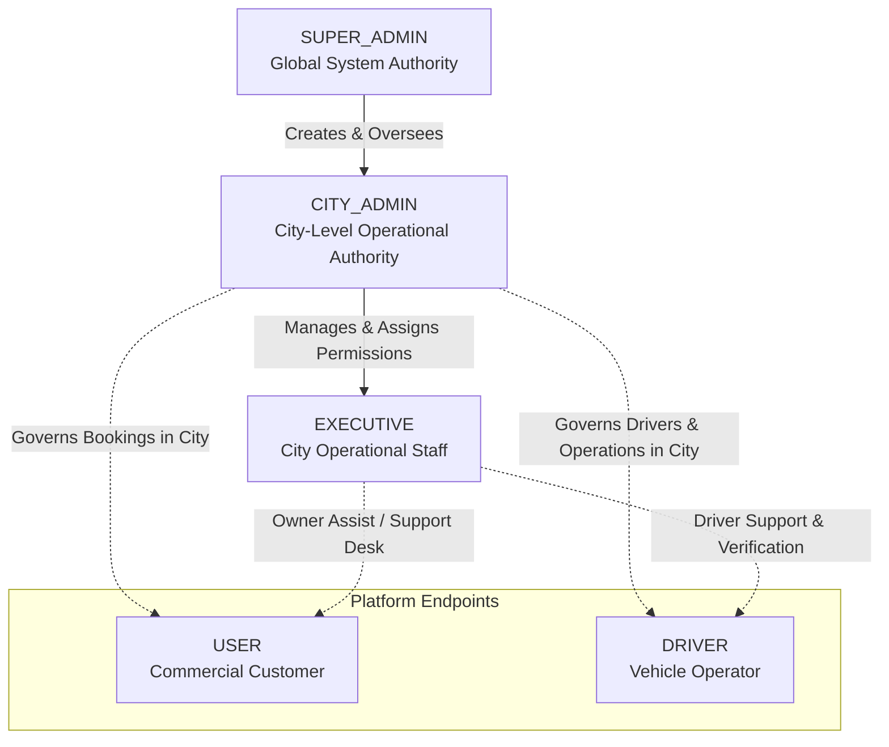
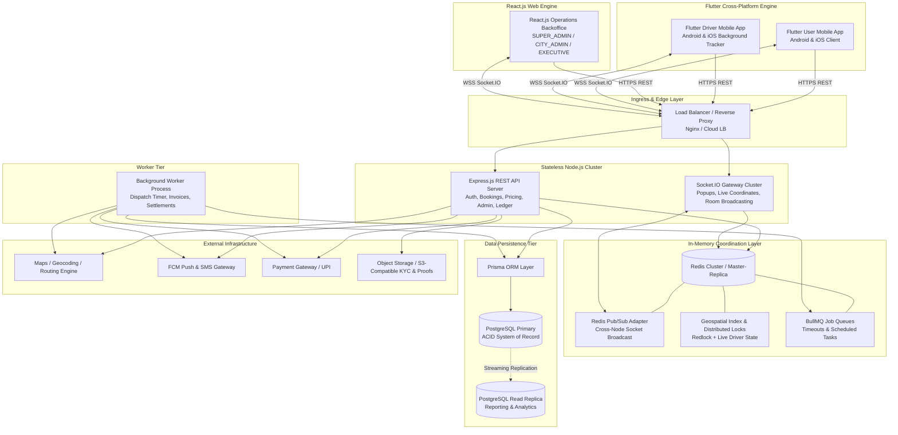
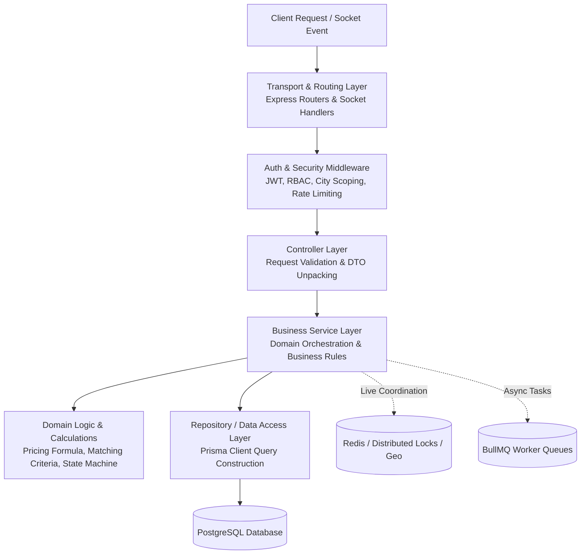
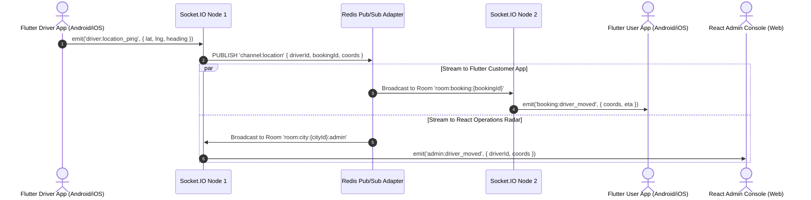
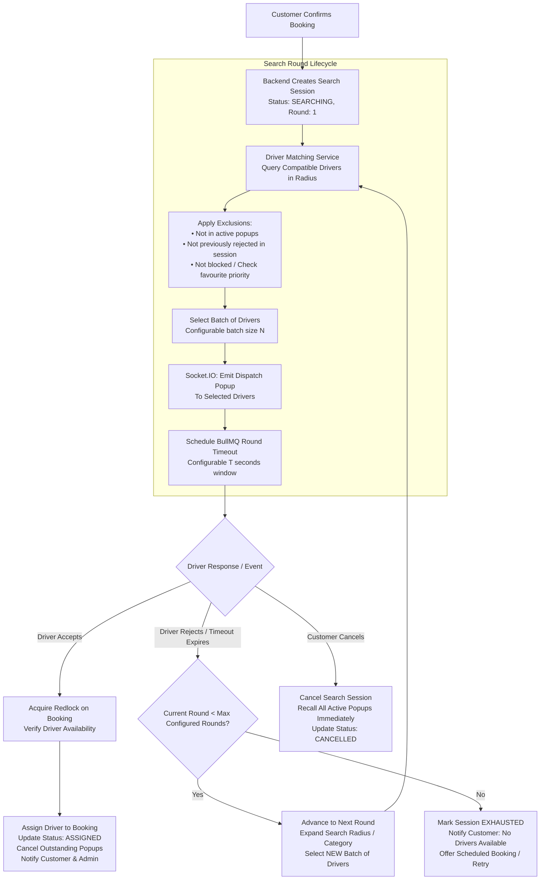
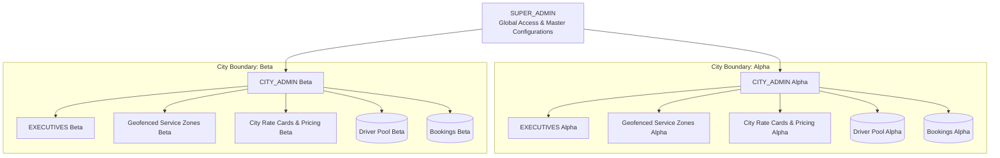
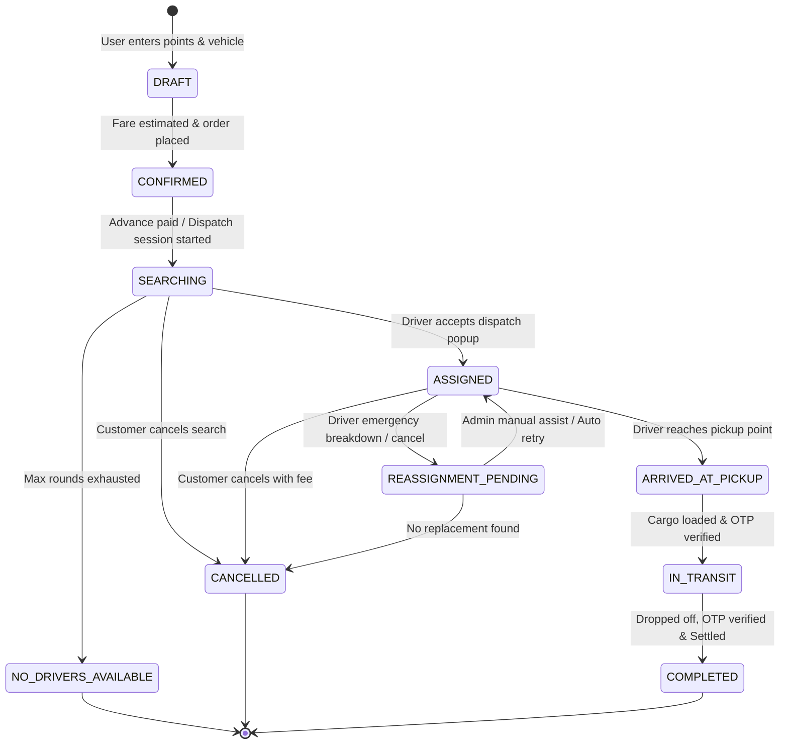
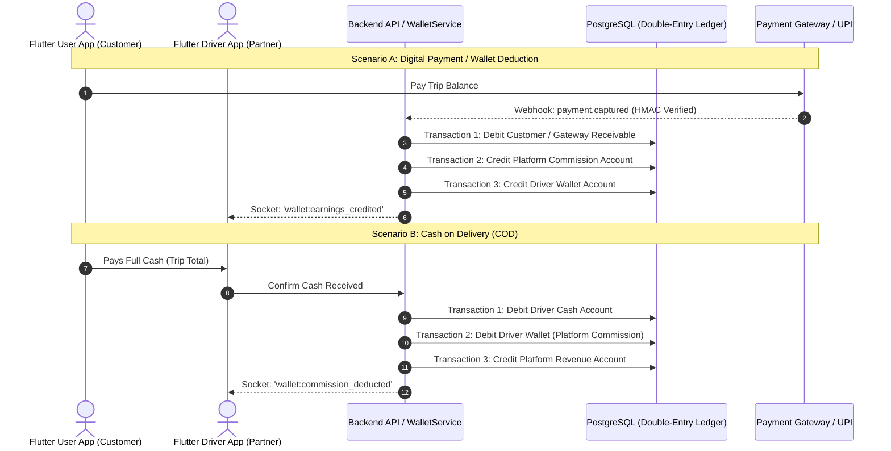
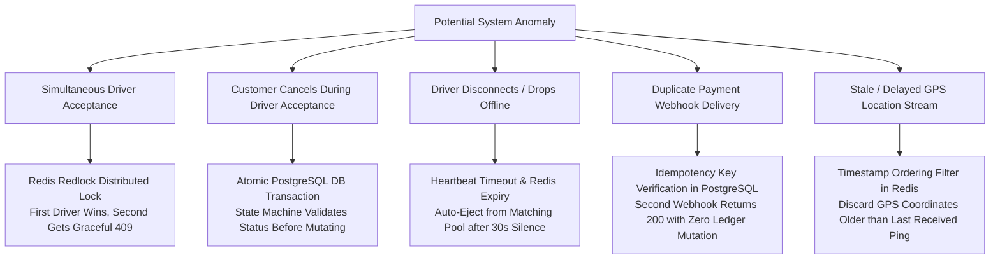

# Master System Architecture Document
**Platform:** On-Demand Logistics & Goods Transportation Platform (Porter-like Architecture)  
**Document Code:** `ARCH-01-SYS-BLUEPRINT`  
**Status:** Approved Technical Master Blueprint  
**Version:** 1.0.0  

---

## 1. Document Purpose

This document serves as the **Master System Architecture Blueprint** for the on-demand logistics and goods transportation platform. It defines the high-level technical topology, architectural patterns, component responsibilities, real-time coordination paradigms, multi-city tenancy model, data boundaries, and operational failure modes.

### 1.1 Scope and Boundaries
* **In Scope:** High-level system structure, modular service decomposition, real-time state synchronization, backend-controlled dispatch mechanics, multi-city data isolation, security architecture, resilience patterns, and scalability strategies.
* **Out of Scope:** Detailed Prisma schema field definitions, specific REST API payloads, frontend UI design tokens, and infrastructure-as-code scripts (which are codified in downstream architecture specifications `02` through `08`).

### 1.2 Master Blueprint Role
This document is the foundational architectural contract for all engineering tracks (Backend, Frontend, DevOps, and QA). Downstream specifications (Database Design, API Catalog, Real-Time Protocols, Dispatch Engine, and Security Specs) must strictly conform to the architectural guidelines, role taxonomies, and state ownership principles established herein.

```
┌──────────────────────────────────────────────────────────────────┐
│             Architecture/01-System-Architecture.md               │
│               (Master Technical Architecture)                    │
└────────────────────────────────┬─────────────────────────────────┘
                                 │ Informs & Governs
         ┌───────────────────────┼───────────────────────┐
         ▼                       ▼                       ▼
┌──────────────────┐   ┌──────────────────┐   ┌──────────────────┐
│  02-Data-Model   │   │ 03-API-Transport │   │ 04-Dispatch-Engine│
│  & Prisma Schema │   │  Specifications  │   │  & Real-Time     │
└──────────────────┘   └──────────────────┘   └──────────────────┘
```

---

## 2. System Overview

### 2.1 Vision & Platform Model
The platform is an enterprise-grade, on-demand and scheduled intracity goods logistics platform engineered to connect commercial freight customers (`USER`) with verified commercial truck, three-wheeler, and two-wheeler drivers (`DRIVER`). 

The platform operates on a **high-throughput, low-latency matching and dispatch architecture** tailored for commercial transport complexities, including multi-stop routes, waiting time calculation, vehicle category payload matching, loading/unloading labor options, advance payments, wallet ledgers, GST-compliant invoicing, and operational monitoring.

### 2.2 Core Operational Pillars
1. **Intelligent Dynamic Dispatch Engine:** A multi-round, sequential driver matching engine that queries compatible nearby drivers in configurable batches and expansion rings without client-side state dependency.
2. **City-Centric Tenancy & Administration:** Strict logical boundary isolation per operational city with hierarchical role delegation (`SUPER_ADMIN` $\rightarrow$ `CITY_ADMIN` $\rightarrow$ `EXECUTIVE`).
3. **Dual State Engine (Persistent vs. Ephemeral):** Relational integrity anchored in PostgreSQL via Prisma ORM, coupled with low-latency live dispatch coordination and geospatial tracking anchored in Redis and Socket.IO.
4. **Resilient Financial & Wallet Engine:** Double-entry ledger accounting supporting customer credits, driver escrow, cash on delivery (COD), advance payments, and subscription deductions.

---

## 3. Technology Stack

The platform employs a decoupled, multi-client architecture connecting specialized web and mobile frontends to a unified Node.js backend:

```
┌────────────────────────────────────────────────────────────────────────┐
│                              CLIENT TIER                               │
├────────────────────────────────────┬───────────────────────────────────┤
│        WEB PLATFORM (React.js)     │     MOBILE PLATFORM (Flutter)     │
│  • SUPER_ADMIN Backoffice          │  • USER Mobile App (iOS / Android)│
│  • CITY_ADMIN Management Console   │  • DRIVER Partner App (iOS/Android│
│  • EXECUTIVE Operations Desk       │                                   │
└────────────────────────────────────┴───────────────────────────────────┘
                                    │ HTTPS (REST) / WSS (Socket.IO)
┌───────────────────────────────────▼────────────────────────────────────┐
│                         TRANSPORT & GATEWAY                            │
│  Node.js + Express.js REST API + Socket.IO WebSocket Server Gateway    │
└─────────────────┬───────────────────────────────────┬──────────────────┘
                  │                                   │
┌─────────────────▼──────────────────┐   ┌────────────▼──────────────────┐
│        PERSISTENCE LAYER           │   │    IN-MEMORY COORDINATION     │
│  PostgreSQL (Relational Database)  │   │  Redis (Pub/Sub, Locks, Cache)│
│  Prisma ORM (Data Access Layer)    │   │  BullMQ (Async Job Workers)   │
└────────────────────────────────────┘   └───────────────────────────────┘
```

### 3.1 Stack Component Matrix

| Layer / Platform | Technology | Primary Architectural Responsibility | Justification & Boundary |
| :--- | :--- | :--- | :--- |
| **Web Platform** | `React.js` | Web Single Page Application (SPA) for `SUPER_ADMIN`, `CITY_ADMIN`, and `EXECUTIVE` operations consoles. | Rich desktop backoffice workflows, multi-city live radar, rate card editors, KYC document auditing, dispute desks. |
| **Mobile Platform (Customer)** | `Flutter` (Dart) | Native cross-platform mobile application (Android + iOS) for `USER` customers. | High-performance mobile UI, native map rendering, smooth polyline animations, UPI intent gateway invocations, push notification deep links. |
| **Mobile Platform (Driver)** | `Flutter` (Dart) | Native cross-platform mobile application (Android + iOS) for `DRIVER` partners. | Reliable background GPS tracking services, full-screen audio dispatch popups, turn-by-turn navigation handoff, camera cargo verification. |
| **Backend API** | `Node.js` + `Express.js` | Central application server, REST API endpoints, business logic execution, domain validation. | Non-blocking asynchronous I/O, modular domain structure, centralized middleware pipeline. **Sole source of business truth.** |
| **Real-Time Gateway** | `Socket.IO` | Bidirectional low-latency event transport for dispatch popups, location streaming, and state sync. | Connects to Flutter User App, Flutter Driver App, and React Admin Web. Managed via Redis Pub/Sub adapter. |
| **Persistent Storage** | `PostgreSQL` | System of Record for all relational business entities (users, bookings, ledgers, rate cards). | ACID transactional integrity, strict relational foreign keys, row-level locking, audit logs. |
| **Data Access Layer** | `Prisma ORM` | Type-safe query generation, migration management, relational mapping. | Enforces schema validation at compile time; abstracts raw queries while supporting native PostgreSQL transactions. |
| **In-Memory Cache & State** | `Redis` | Ephemeral coordination, distributed locking (`Redlock`), geospatial indices (`GEOSEARCH`), rate limiting. | High-throughput sub-millisecond data store for active driver coordinates, dispatch session locks, and live socket mapping. |
| **Background Processing** | `BullMQ` (Redis-backed) | Asynchronous task queues, dispatch timeout schedules, payout batching, invoice generation. | Decouples long-running, scheduled, or retry-heavy tasks from the synchronous API request loop. |

---

## 4. Business System Context

The platform addresses the logistical complexities of urban commercial transport:

```
                      ┌───────────────────────────┐
                      │    Logistics Ecosystem    │
                      └─────────────┬─────────────┘
          ┌─────────────────────────┼─────────────────────────┐
          ▼                         ▼                         ▼
┌───────────────────┐     ┌───────────────────┐     ┌───────────────────┐
│     Customers     │     │  Vehicle Fleets   │     │  Administration   │
│     (`USER`)      │     │    (`DRIVER`)     │     │    & Operations   │
├───────────────────┤     ├───────────────────┤     ├───────────────────┤
│ • On-demand/Sched │     │ • 2-Wheel / 3-Wheel│     │ • Super Admin     │
│ • Multi-stop Goods│     │ • Mini Trucks/Tata│     │ • City Operations │
│ • Wallet & Cash   │     │ • Subscriptions   │     │ • Executive Desk  │
│ • GST Invoicing   │     │ • KYC & Onboarding│     │ • Owner Assist    │
└───────────────────┘     └───────────────────┘     └───────────────────┘
```

### 4.1 Goods Movement Capabilities
* **Vehicle Categories:** Categorized by volumetric capacity, payload weight limits (e.g., 2-Wheeler, 3-Wheeler, 8ft Pickup, Tata Ace, 14ft Truck), and body type (open vs. container).
* **Multi-Stop Logistics:** Bookings support 1 pickup point and up to $N$ sequential drop points with individual receiver contacts and drop-off verification.
* **Loading / Unloading Services:** Optional driver/helper labor line items priced via city rate cards.
* **Waiting Time Billing:** Auto-calculated demurrage fees applied when driver wait times at pickup/drop exceed configurable free-tier thresholds.
* **Package Verification:** Pre-trip and post-trip cargo photo uploads stored via secure object storage to prevent damage disputes.

### 4.2 Financial & Commercial Constructs
* **Rate Cards:** Multi-tier, admin-configured pricing models per vehicle category per city: Base Fare, Base Distance, Per-KM Fare, Per-Minute Moving Fare, Waiting Fare, Toll/Surge Multipliers, and GST rates.
* **Dual Wallet Engine:**
  * **Customer Wallet:** Pre-funded credits, refund disbursements, promotional credits.
  * **Driver Wallet:** Earning settlement, daily subscription fee deductions, commission debits, platform payout escrow.
* **Advance & Split Payments:** Support for partial advance payment at booking time and remaining balance settlement upon delivery via Cash, UPI, or Online Gateway.

---

## 5. User and Administrative Hierarchy

The system enforces a strict 5-tier role hierarchy. Operational staff operate strictly within authorized city boundaries, while end-users and drivers interact via customer and driver interfaces.



### 5.1 Role Definitions & Permission Matrix

| Role | Operational Scope | Core Responsibilities | Tenancy Restriction |
| :--- | :--- | :--- | :--- |
| `SUPER_ADMIN` | **Global System-Wide** | Multi-city creation, global rate parameters, city admin provisioning, financial settlements, system configuration, master audit log access. | Unrestricted (Global access to all cities and records). |
| `CITY_ADMIN` | **Assigned City Only** | City rate cards, geofenced zones, vehicle category activation, executive user provisioning, local driver onboarding approval, city-level analytics. | Strict City Isolation (`cityId` bound). |
| `EXECUTIVE` | **Assigned City Only** | Driver KYC verification, booking tracking, manual driver assignment/reassignment, dispute resolution, "Owner Assist" operational handling. | Strict City Isolation (`cityId` bound) + Granular Permission Flags. |
| `USER` | **Customer Context** | Trip creation, live tracking, multi-stop configuration, payment settlement, invoice download, driver rating, favorite/blocked driver management. | User-owned records only. |
| `DRIVER` | **Driver Context** | Receiving dispatch popups, accepting/rejecting rides, location broadcasting, trip state transitions (Arrived, OTP Verification, Delivered), wallet cashouts. | Driver-owned records only. |

### 5.2 Executive Granular Permission Engine
`EXECUTIVE` accounts operate under a permission mask assigned by their parent `CITY_ADMIN`. Permissions include:
* `CAN_APPROVE_KYC`: Authorize driver documents and vehicle registrations.
* `CAN_MANUAL_DISPATCH`: Override automated dispatch and assign specific drivers.
* `CAN_CANCEL_BOOKING`: Execute administrative trip cancellation with refund overrides.
* `CAN_ADJUST_WALLET`: Issue operational wallet credits/debits up to a city-capped threshold.
* `CAN_VIEW_FINANCIALS`: Access city revenue and driver payout ledgers.

---

## 6. High-Level System Architecture

The platform is designed as a **Unified Modular Monolith** serving two distinct client ecosystems (React Web for Administration and Flutter Mobile for Customer/Driver applications) with decoupled real-time and background worker layers.



---

## 7. Application Components

The system is factored into 14 distinct logical components:

```
┌──────────────────────────────────────────────────────────────────────────┐
│                           14 SYSTEM COMPONENTS                           │
├───────────────────────────────┬──────────────────────────────────────────┤
│ 1. React Web Admin Console    │ 8. Background Worker (BullMQ)            │
│ 2. Flutter User Mobile App    │ 9. Maps & Routing Provider               │
│ 3. Flutter Driver Mobile App  │ 10. Push & SMS Notification Gateway      │
│ 4. Node.js / Express Backend  │ 11. Object Storage (S3-Compatible)       │
│ 5. PostgreSQL Database (ACID) │ 12. Central Control & Operations Layer   │
│ 6. Prisma ORM Layer           │ 13. Customer Domain & Wallet Module      │
│ 7. Socket.IO Real-Time Engine │ 14. Driver Fleet & Dispatch Module       │
└───────────────────────────────┴──────────────────────────────────────────┘
```

### 7.1 Component Descriptions & Boundaries

#### 1. React Web Admin Console (Web Platform)
* **Responsibility:** Operations and control plane for `SUPER_ADMIN`, `CITY_ADMIN`, and `EXECUTIVE` backoffice staff.
* **Why it exists:** Provides dense desktop workflows for city rate card creation, live geospatial radar monitoring, KYC document verification, and "Owner Assist" manual dispatch.
* **Communication:** Communicates with Backend API via HTTPS REST endpoints and Socket.IO via Secure WebSockets (`wss://`).
* **Data Handled:** Admin session JWTs, city configuration forms, audit logs, dispute cases, system analytics.

#### 2. Flutter User Mobile Application (Mobile Platform - Android & iOS)
* **Responsibility:** Primary customer interface for freight booking, real-time vehicle tracking, multi-stop route input, digital payment, and rating.
* **Why it exists:** Provides a native, smooth, responsive mobile experience on both Android and iOS with native map polyline animations, UPI intent gateway support, and push notifications.
* **Communication:** Communicates with Backend API via HTTPS REST endpoints and Socket.IO via `socket_io_client`.
* **Data Handled:** Customer authentication tokens, active booking snapshots, cached map route waypoints, wallet transactions.

#### 3. Flutter Driver Mobile Application (Mobile Platform - Android & iOS)
* **Responsibility:** Driver-partner operating console for shift management (Online/Offline), receiving full-screen dispatch popups, streaming live GPS coordinates, navigation handoff, and OTP completion.
* **Why it exists:** Manages native mobile device capabilities (foreground location services, background execution, full-screen audio alerts, high-frequency GPS polling).
* **Communication:** High-frequency WebSocket stream to Socket.IO and HTTPS REST for transactional transitions.
* **Data Handled:** Driver auth credentials, active popup countdown states, waypoint coordinates, delivery photo proofs.

#### 4. Node.js / Express Backend (Application Server)
* **Responsibility:** Central orchestration, API validation, business rule enforcement, cryptographic auth, transaction lifecycle management.
* **Why it exists:** Provides a unified, high-performance, non-blocking I/O execution environment for all business operations.
* **Communication:** Listens to Load Balancer; talks to PostgreSQL via Prisma, Redis via `ioredis`, and external third-party SDKs.
* **Data Handled:** Domain entities, credentials, transactional records, rate cards, business configurations.

#### 5. PostgreSQL Database (System of Record)
* **Responsibility:** Persistent, durable, ACID-compliant storage of all relational business data.
* **Why it exists:** Ensures guaranteed financial consistency, referential integrity, and relational durability.
* **Communication:** Accepts queries exclusively from Prisma ORM; streams data to read replicas.
* **Data Handled:** Users, Drivers, KYC, Vehicles, Bookings, Ledger Entries, Invoices, City Boundaries.

#### 6. Prisma ORM (Data Access Layer)
* **Responsibility:** Type-safe database mapping, programmatic query composition, connection pooling, and schema migration management.
* **Why it exists:** Eliminates SQL injection vulnerabilities, enforces strict TypeScript-like schema contracts, and manages transactional boundaries.
* **Communication:** Sits between Node.js service logic and PostgreSQL.
* **Data Handled:** Object-relational entities and database mutation transactions.

#### 7. Socket.IO Real-Time Engine (WebSocket Gateway)
* **Responsibility:** Stateful bi-directional event transport, live location dissemination, dispatch popup delivery, and presence management.
* **Why it exists:** Delivers sub-second event broadcasts required for instant driver matching, customer live tracking, and admin radar.
* **Communication:** Connects to Flutter User App, Flutter Driver App, and React Admin Web; coordinates across instances using the Redis Pub/Sub adapter.
* **Data Handled:** Connection socket IDs, room memberships, live coordinate streams, popup response events.

#### 8. Redis In-Memory Engine
* **Responsibility:** Geospatial indexing (`GEOADD`/`GEOSEARCH`), distributed mutual exclusion locks (`Redlock`), ephemeral session caches, and rate-limiting counters.
* **Why it exists:** Offloads high-frequency transient reads/writes (e.g., driver location pings every 3s) from PostgreSQL.
* **Communication:** Sits alongside Node.js API servers and Socket.IO clusters.
* **Data Handled:** Active driver GPS points, active dispatch session metadata, distributed lock tokens, single-device session bindings.

#### 9. Background Job / Worker Layer (BullMQ)
* **Responsibility:** Asynchronous job processing, dispatch timeout evaluations, invoice PDF generation, automated refund processing, and scheduled ride triggering.
* **Why it exists:** Guarantees that heavy computations and time-delayed operations do not block the Express HTTP event loop.
* **Communication:** Reads from and writes to Redis queues; mutates PostgreSQL state via Prisma.
* **Data Handled:** Serialized job payloads (e.g., `{ bookingId, roundNumber, expireAt }`).

#### 10. Payment Gateway Provider
* **Responsibility:** External payment capture, UPI intent processing, card tokenization, and payout disbursements.
* **Why it exists:** Processes secure fiat monetary transactions and bank transfers.
* **Communication:** HTTPS calls from Node.js backend; mobile SDK invocations on Flutter; inbound webhook callbacks to backend.
* **Data Handled:** Transaction tokens, payment order IDs, webhook signatures, refund receipts.

#### 11. Maps & Geolocation Provider
* **Responsibility:** Forward/reverse geocoding, distance matrix calculations, snap-to-road polyline routing, and ETA estimations.
* **Why it exists:** Provides spatial intelligence and route mathematics for fare calculation and live trip routing.
* **Communication:** Server-side HTTPS REST requests; client-side map rendering in Flutter and React.
* **Data Handled:** Lat/Lng coordinates, address strings, distance matrices, encoded polylines.

#### 12. Push Notification & SMS Provider (FCM / APNs / SMS Gateway)
* **Responsibility:** Out-of-band communication for OTP verification, booking confirmations, dispatch alerts, and emergency notifications.
* **Why it exists:** Reaches Flutter mobile apps when backgrounded or closed, and delivers SMS OTPs.
* **Communication:** Backend worker triggers outbound HTTPS API requests to Firebase Cloud Messaging (FCM) and SMS gateways.
* **Data Handled:** Phone numbers, FCM/APNs device push tokens, notification payloads.

#### 13. Object / File Storage (S3-Compatible)
* **Responsibility:** Secure, durable binary asset storage for driver licenses, vehicle permits, and pre/post-trip cargo condition photos.
* **Why it exists:** Keeps binary blobs out of PostgreSQL to preserve database performance and compact backups.
* **Communication:** Backend generates secure presigned upload/download URLs for Flutter apps and React console.
* **Data Handled:** JPEG/PNG/PDF binary blobs and encrypted metadata keys.

#### 14. Central Control & Operations Layer (Owner Assist Engine)
* **Responsibility:** Operational coordination module enabling City Admins and Executives to monitor real-time city health, execute manual overrides, and manage driver fleets.
* **Communication:** Integrates Express Controllers, Socket.IO rooms, and Admin Service logic.
* **Data Handled:** City KPIs, unassigned booking queues, live driver distribution maps.

---

## 8. Backend Architecture

The backend follows a strictly structured **Layered Clean Architecture** within a modular monolith design. Each request passes through defined tiers with explicit separation of concerns.



### 8.1 Architectural Layers

1. **Transport & Routing Layer (`/routes`, `/sockets`):** Defines HTTP endpoints and WebSocket event bindings. Pure transport responsibility; performs zero business validation.
2. **Authentication & Policy Guard Layer (`/middleware`):** Decodes JWT tokens, validates active single-device sessions against Redis, verifies role-based permissions (`RBAC`), and applies mandatory city scoping.
3. **Controller Layer (`/controllers`):** Validates incoming request structures using schema validators (e.g., Zod), formats parameters into Data Transfer Objects (DTOs), and maps service outcomes to standard HTTP/Socket responses.
4. **Business Service Layer (`/services`):** Implements system business rules, coordinates multi-step database transactions, manages domain events, and integrates third-party services.
5. **Domain Logic Layer (`/domain`):** Pure, deterministic business algorithms (e.g., fare calculation formulas, distance calculations, state transition validations).
6. **Repository & Data Access Layer (`/repositories`):** Wraps Prisma ORM client operations. Enforces consistent tenant query filtering (`where: { cityId }`), pagination, and atomic transaction execution.

### 8.2 Core Domain Services Catalog

```
┌────────────────────────────────────────────────────────────────────────┐
│                        BACKEND SERVICE CATALOG                         │
├───────────────────────┬───────────────────────┬────────────────────────┤
│ • BookingService      │ • DispatchService     │ • DriverMatchingService│
│ • PricingService      │ • TrackingService     │ • PaymentService       │
│ • WalletService       │ • NotificationService │ • AdminService         │
└───────────────────────┴───────────────────────┴────────────────────────┘
```

* **`BookingService`:** Manages the entire lifecycle of normal, scheduled, and multi-stop bookings. Enforces state machine transitions (`DRAFT` $\rightarrow$ `SEARCHING` $\rightarrow$ `ASSIGNED` $\rightarrow$ `ARRIVED` $\rightarrow$ `IN_TRANSIT` $\rightarrow$ `COMPLETED` $\rightarrow$ `CANCELLED`).
* **`DispatchService`:** Orchestrates the multi-round driver search engine, creates and advances search sessions, manages timeout timers, and enforces atomic driver assignment.
* **`DriverMatchingService`:** Evaluates spatial distance, vehicle category compatibility, driver online status, shift eligibility, favorite/blocked driver status, and anti-duplication rules for active search rounds.
* **`PricingService`:** Evaluates city-specific rate cards, computes multi-stop distance matrices, applies loading/unloading fees, calculates waiting demurrage, and applies GST calculations.
* **`TrackingService`:** Ingests high-frequency GPS coordinate streams from drivers into Redis geospatial structures and broadcasts sanitized location feeds to subscribed customers and admins.
* **`PaymentService`:** Integrates payment gateway APIs, verifies cryptographic webhook signatures, executes advance payment captures, and initiates automated refund flows.
* **`WalletService`:** Maintains atomic, double-entry ledger transactions for user balances, driver earnings, platform commissions, and cash-collection offsets.
* **`NotificationService`:** Dispatches multichannel alerts (In-App Sockets, Push Notifications, SMS) based on domain events.
* **`AdminService`:** Provides city-scoped metric aggregations, manual dispatch overrides ("Owner Assist"), driver KYC approvals, and system configuration mutations.

---

## 9. Frontend Architecture

The platform architecture explicitly bifurcates the client layer into two specialized frontend ecosystems: **React.js for Web Administration** and **Flutter for Customer & Driver Mobile Applications**.

```
┌────────────────────────────────────────────────────────────────────────┐
│                    CLIENT LAYER ARCHITECTURAL MATRIX                   │
├────────────────────────────────────────────────────────────────────────┤
│                          PLATFORM A: WEB                               │
│                         Framework: React.js                            │
│  Target Roles: SUPER_ADMIN  •  CITY_ADMIN  •  EXECUTIVE                │
├───────────────────┬────────────────────────────┬───────────────────────┤
│ Master Backoffice │ City Operations Radar      │ Executive Support Desk│
│ • Multi-City Scope│ • Live Driver Heatmap      │ • Driver KYC Approval │
│ • Global Rates    │ • Dispatch Bottleneck Alert│ • Manual Dispatch Deck│
│ • System Ledger   │ • Geofence Zone Editor     │ • Dispute Management  │
├───────────────────┴────────────────────────────┴───────────────────────┤
│                         PLATFORM B: MOBILE                             │
│                  Framework: Flutter (Android & iOS)                    │
│                 Target Roles: USER  •  DRIVER                          │
├────────────────────────────────┬───────────────────────────────────────┤
│ Customer Mobile App (`USER`)   │ Driver Mobile App (`DRIVER`)          │
├────────────────────────────────┼───────────────────────────────────────┤
│ • Interactive Multi-Stop Map   │ • Background High-Frequency GPS Engine│
│ • Smooth Polyline ETA Stream   │ • Full-Screen Audio Dispatch Popups   │
│ • UPI Intent / Card Payments   │ • Turn-by-Turn Nav App Handoff        │
│ • Cargo Picture Proof Upload   │ • Delivery OTP & Cargo Inspection     │
│ • Digital Wallet & GST Center  │ • Earnings Ledger & Cashout Desk      │
└────────────────────────────────┴───────────────────────────────────────┘
```

### 9.1 Web Platform Architecture (`React.js`)
* **Target Audience:** Internal backoffice staff (`SUPER_ADMIN`, `CITY_ADMIN`, `EXECUTIVE`).
* **UI Paradigms:** High-density, multi-window operational dashboards, live geospatial radar maps (Mapbox / Google Maps JS), data grids with server-side pagination, and real-time operational notifications.
* **State Management:** Reactive query caching (e.g., TanStack Query) paired with a persistent WebSocket manager subscribing to city-level administrative rooms (`room:city:{cityId}:admin`).
* **Authentication Storage:** Session tokens stored securely in memory and synchronized via rotating refresh tokens with strict browser CORS boundaries.

### 9.2 Mobile Platform Architecture (`Flutter` - Android & iOS)
* **Target Audience:** Public commercial customers (`USER`) and verified freight drivers (`DRIVER`).
* **Customer App (`USER`):**
  * **Native Map & Routing:** Embedded native map rendering with hardware-accelerated polyline rendering and smooth vehicle marker interpolation as driver GPS updates stream in.
  * **Payment Integration:** Native mobile SDK hooks for seamless UPI Intent app-switching, credit/debit card tokenization, and customer wallet debits.
  * **Lifecycle & Sync:** Background push notifications (FCM / APNs) wake the app on state changes (e.g., driver arrived, delivery completed).
* **Driver Partner App (`DRIVER`):**
  * **Background Location Engine:** Native background tracking service (Android Foreground Service with ongoing notification; iOS CoreLocation Background Execution) broadcasting GPS pings every 3 seconds to Socket.IO even when the app is minimized or the screen is locked.
  * **Dispatch Radar Overlay:** Native full-screen popup dialogs with loud audio chime alerts, 15-second visual countdown rings, and accept/reject action triggers.
  * **Navigation Handoff:** One-tap integration passing waypoints directly to Google Maps or Waze native apps.
  * **Secure Storage:** Cryptographic hardware storage (`flutter_secure_storage` backed by Android KeyStore / iOS Keychain) storing unique device IDs and JWT credentials.

### 9.3 Unified Client-Server Principles
1. **Zero Client-Side Dispatch Authority:** Neither React Web nor Flutter Mobile apps ever decide dispatch timeouts, round progressions, candidate driver selection, or fare totals. All UIs are strict reactive projections of backend state.
2. **Standardized API Contracts:** All three frontend targets communicate with the identical Node.js + Express REST API endpoints and Socket.IO gateway.
3. **WebSocket Synchronization & Recovery:** Upon network disconnection and reconnect, mobile and web clients query the REST endpoint (`GET /api/v1/bookings/active`) to achieve 100% state reconciliation before rendering.
4. **Single-Device Enforcement:** Login actions send native hardware device identifiers. The backend invalidates any prior active session for that account in Redis, immediately logging out stale devices.

---

## 10. Data Architecture

The data architecture establishes clear boundaries between **Persistent Storage (PostgreSQL)** and **Ephemeral/Coordination State (Redis)**.

```
┌──────────────────────────────────────────────────────────────────────────┐
│                             DATA ARCHITECTURE                            │
├─────────────────────────────────────┬────────────────────────────────────┤
│     PostgreSQL (System of Record)   │    Redis (Ephemeral & Live State)  │
├─────────────────────────────────────┼────────────────────────────────────┤
│ • User & Driver Profiles / KYC Docs │ • Active Driver Coordinates (GEO)  │
│ • Completed & Historical Bookings   │ • Live Dispatch Session Metadata   │
│ • Ledger Entries (Double-Entry)     │ • Distributed Locks (Assignment)   │
│ • City Rate Cards & Geofences       │ • Active Socket IDs & Room Maps    │
│ • Invoices, Taxes & GST Records     │ • Rate Limiting & OTP Attempt TTLs │
│ • Immutable System Audit Logs       │ • Single-Device Active JWT Tokens  │
└─────────────────────────────────────┴────────────────────────────────────┘
```

### 10.1 Storage Responsibilities

* **PostgreSQL (System of Record):** 
  * All entities requiring financial auditability, legal compliance, and relational consistency reside permanently in PostgreSQL.
  * Writes are executed within explicit database transactions managed by Prisma.
  * Soft deletes (`deletedAt` timestamps) are enforced across all primary entities to preserve relational history.
* **Redis (Ephemeral & Real-Time Engine):**
  * Holds transient live state that changes at high frequency (driver GPS pings every 3 seconds) where relational disk I/O would create bottlenecks.
  * Holds atomic distributed locks during driver assignment to guarantee zero double-allocations.
  * If Redis crashes, ephemeral state (e.g., driver location) is re-populated within seconds by the next client ping, while persistent booking states remain 100% intact in PostgreSQL.

---

## 11. Real-Time Architecture

The real-time layer is built on **Socket.IO** backed by a **Redis Pub/Sub Adapter**, enabling seamless horizontal scaling across multiple Node.js server instances while serving both Flutter mobile and React web clients.



### 11.1 Socket Room Topologies
Socket connections are authenticated during the initial WebSocket handshake via JWT. Upon connection, the server places sockets into isolated logical rooms:

1. `room:user:{userId}`: Personal notification channel for Flutter User App alerts, payment receipts, and driver matched events.
2. `room:driver:{driverId}`: Exclusive channel for Flutter Driver App dispatch popups, ride offer retries, and payout alerts.
3. `room:booking:{bookingId}`: Shared channel joining the active Flutter Customer App, assigned Flutter Driver App, and monitoring React Admin Consoles for real-time trip tracking, coordinate streaming, and status transitions.
4. `room:city:{cityId}:admin`: Broadcast channel for React Admin Consoles (City Admins and Executives) monitoring live city dispatch heatmaps and high-value order alerts.

### 11.2 Mobile Socket Lifecycle & Push Notification Fallback
* **App Inactive / Background State:** If a mobile client (Customer or Driver) is backgrounded and the OS terminates the WebSocket connection, the backend detects socket disconnect within 10 seconds.
* **FCM / APNs Wake-up Trigger:** Critical events (such as new dispatch popups or booking status changes) are immediately routed through Firebase Cloud Messaging (FCM) / Apple Push Notification Service (APNs) with high-priority data payloads to wake the Flutter background handler.
* **Socket.IO is NOT the Source of Truth:** Sockets are strictly a transport mechanism for ephemeral events and UI updates.
* **State Verification on Action:** When a driver clicks "Accept" on a socket-delivered popup, the Flutter client sends a cryptographically signed REST or Socket RPC action that **validates the state against the database/Redis lock before confirming the assignment**.

---

## 12. Dispatch Architecture

The dispatch system is the core operational engine of the platform. It replaces crude client-side toggles with a robust, **Backend-Governed Sequential Search Session Engine**.



### 12.1 Conceptual Dispatch Domain Entities

* **`Booking`:** The primary business entity representing the transportation agreement, cargo specifications, and financial settlement.
* **`SearchSession`:** The orchestrator of a driver discovery attempt for a specific booking. Tracks total rounds elapsed, start/end timestamps, and final outcome (`ASSIGNED`, `EXHAUSTED`, `CANCELLED`).
* **`SearchRound`:** A discrete search iteration within a session. Maintains the specific search radius, category expansion tier, candidate drivers contacted, and the exact timeout window.
* **`DriverRideRequest`:** The ephemeral offer presented to a specific driver during a round. Tracks popup delivery time, response status (`PENDING`, `ACCEPTED`, `REJECTED`, `TIMEOUT`), and response latency.

### 12.2 Key Dispatch Rules & Constraints
1. **Strict Backend Authority:** Dispatch progression, timeouts, and batch expansions are driven exclusively by server-side workers (BullMQ) and domain services.
2. **Single Active Popup Rule:** A driver can have at most **one** active, pending ride request popup across the entire platform at any given millisecond. Redis distributed keys (`driver:active_popup:{driverId}`) enforce this invariant.
3. **Anti-Duplication in Session:** A driver who rejects a ride or allows a popup to time out in Round 1 will **not** be queried again in subsequent rounds of the same `SearchSession` unless explicitly enabled by administrative emergency override rules.
4. **Configurable, Non-Hardcoded Parameters:** Batch driver counts (e.g., $N=4$), response windows (e.g., $T=15\text{s}$), search radii (e.g., $3\text{km} \rightarrow 5\text{km} \rightarrow 8\text{km}$), and maximum rounds (e.g., $R=5$) are stored in database-backed, city-specific rate cards and operational configurations.
5. **Atomic Assignment Guard:** When multiple drivers attempt to accept the same booking near-simultaneously, the backend executes an atomic distributed lock (`Redlock`) on `booking:lock:{bookingId}`. The first driver to acquire the lock updates PostgreSQL within a serializable transaction; all subsequent requests receive an immediate graceful error (`"Ride already assigned"`).
6. **Instant Cancellation Broadcast:** If a customer cancels a booking while popups are active on driver devices, the `DispatchService` immediately marks the session cancelled and emits `popup:cancelled` to all candidate driver sockets, dismissing their popup dialogs instantly.

---

## 13. City / Multi-City Architecture

The platform enforces a strict multi-city tenancy model. The system is designed to support seamless operational scaling across hundreds of independent municipal jurisdictions without data leakage.



### 13.1 Architectural Enforcement of City Boundaries
* **Database Tenancy Scoping:** Every operational record (`Driver`, `Vehicle`, `Booking`, `RateCard`, `Geofence`, `Executive`) contains a mandatory foreign key `cityId`.
* **Backend Authorization Guards:** Express middleware intercepts all administrative requests, extracts the authenticated actor's `cityId` from their JWT, and injects mandatory query filters into Prisma repositories (`WHERE cityId = req.user.cityId`).
* **Zero Client-Side Trust:** City isolation is never left to React frontend UI filtering. Any administrative attempt to mutate or read an entity belonging to a different `cityId` triggers an immediate `403 Forbidden` and security audit log entry.
* **Global Super Admin Visibility:** `SUPER_ADMIN` accounts possess a bypass flag enabling global cross-city analytics, system-wide financial aggregation, and inter-city parameter configuration.

---

## 14. External Services

```
┌─────────────────────────────────────────────────────────────────────────┐
│                      EXTERNAL INTEGRATIONS MATRIX                       │
├──────────────────────┬──────────────────────────┬───────────────────────┤
│ Integration Domain   │ External Service Type    │ Primary Purpose       │
├──────────────────────┼──────────────────────────┼───────────────────────┤
│ Maps & Geocoding     │ Google Maps / MapmyIndia │ Routing, ETA, Geocode │
│ Push Notifications   │ Firebase Cloud Messaging │ Mobile Device Pushes  │
│ SMS & Verification   │ Twilio / Fast2SMS / MSG91│ Phone OTP Auth & SMS  │
│ Payment Gateway      │ Razorpay / Cashfree      │ UPI, Cards & Escrow   │
│ Binary File Storage  │ AWS S3 / Cloudflare R2   │ KYC Docs & Cargo Pics │
└──────────────────────┴──────────────────────────┴───────────────────────┘
```

### 14.1 External Service Integration Patterns
1. **Asynchronous Dispatching:** External calls that are not strictly on the critical path of an HTTP request (such as sending SMS notifications, generating PDF invoices, or uploading archival photos) are dispatched to BullMQ background workers.
2. **Circuit Breaker & Fallback:** Maps and routing calculations employ timeout limits and fallback to straight-line haversine approximations with historical city traffic multipliers in the event of external API outages.
3. **Webhook Signature Verification:** All incoming payment and external status webhooks are validated against shared cryptographic secrets (`HMAC-SHA256`) before any internal state change or ledger entry is processed.

---

## 15. Core Business Data Flows

### 15.0 Booking State Lifecycle Flow


### 15.1 Flow 1: User Creates Booking (Draft Initiation)
1. `USER` enters pickup address, $N$ drop-off addresses, cargo category, package photos, and required vehicle category in the Flutter User Mobile App.
2. Request hits `POST /api/v1/bookings/draft`.
3. `BookingService` initializes an ephemeral `DRAFT` booking record with multi-stop waypoint sequences.
4. Validation ensures all waypoints reside within valid service geofences for the detected city.

### 15.2 Flow 2: Fare Estimation & Rate Card Calculation
1. Flutter User App requests `POST /api/v1/pricing/estimate` with draft booking parameters.
2. `PricingService` calls Maps Provider for precise driving distances, toll waypoints, and travel durations across all stops.
3. Pricing formula calculates base fare, incremental distance slabs, moving time, loading/unloading labor items, and GST from the city rate card.
4. A signed fare estimate quote with an expiration TTL (e.g., 5 minutes) is returned to the Flutter app.

### 15.3 Flow 3: Booking Confirmation & Advance Payment
1. `USER` accepts the fare quote and selects a payment method (Wallet, Online UPI/Card via native SDK, or COD) in the Flutter User App.
2. If advance payment or full prepay is required, `PaymentService` captures the payment or places a hold on the Customer Wallet.
3. `BookingService` updates booking status to `CONFIRMED` and immediately triggers `DispatchService`.

### 15.4 Flow 4: Driver Search & Dispatch Lifecycle
1. `DispatchService` creates a `SearchSession` (Round 1) in PostgreSQL and Redis.
2. `DriverMatchingService` queries Redis Geospatial index (`GEOSEARCH`) for online, compatible drivers within the Round 1 radius.
3. Exclusion filters remove drivers with active popups, drivers who rejected this session, and blocked drivers; favorite drivers are given priority ranking.
4. Popups are emitted via Socket.IO directly to candidate Flutter Driver Apps (`room:driver:{id}`).
5. BullMQ schedules a round expiry timer.
6. If no acceptance occurs within the window, the session advances to Round 2 with expanded radius/category parameters.

### 15.5 Flow 5: Driver Accepts Ride
1. `DRIVER` taps "Accept" on the Flutter Driver App full-screen dispatch popup.
2. Request hits `POST /api/v1/dispatch/accept`.
3. Backend acquires distributed lock `booking:lock:{bookingId}` in Redis.
4. Backend verifies that the booking is still in `SEARCHING` state and driver is still `ONLINE` and `UNASSIGNED`.
5. In an atomic PostgreSQL transaction via Prisma:
   * Booking status transitions to `ASSIGNED`.
   * Driver status transitions to `BUSY`.
   * `SearchSession` is marked `COMPLETED`.
6. Distributed lock is released.
7. Socket.IO emits `booking:matched` to Flutter Customer App (`room:booking:{id}`), dismisses outstanding popups on candidate Flutter Driver Apps, and alerts the React Admin Console radar.

### 15.6 Flow 6: Customer Cancels Booking
1. `USER` initiates cancellation via Flutter User App interface.
2. `BookingService` verifies booking status:
   * **During `SEARCHING`:** `SearchSession` is terminated immediately; `popup:cancelled` is emitted to all candidate Flutter Driver Apps; holds are released back to Customer Wallet.
   * **During `ASSIGNED`:** Cancellation fee is assessed if driver transit time exceeds grace window; fee is split between platform revenue and driver wallet compensation; driver returns to `ONLINE`.
3. Booking state transitions to `CANCELLED`.

### 15.7 Flow 7: Driver Cancels After Pickup / Emergency Breakdown
1. `DRIVER` triggers emergency breakdown / cancellation from Flutter Driver App mobile console.
2. `BookingService` logs emergency incident and alerts React Admin Console (City Admin & Executive desk) via high-priority socket event.
3. `Booking` status shifts to `REASSIGNMENT_PENDING`.
4. Executive can either manually assign an available nearby driver via React Console ("Owner Assist") or allow `DispatchService` to launch an automated emergency search session from current vehicle coordinates.
5. Trip history, cargo photos, and waypoint progress transfer seamlessly to the replacement driver's Flutter app.

### 15.8 Flow 8: Driver Live Location Update
1. Active Flutter Driver App background location service broadcasts GPS coordinates every 3 seconds via WebSocket event `driver:location_update`.
2. Socket server updates Redis Geospatial index (`GEOADD drivers:city:{cityId}`) and updates driver heading/speed.
3. If driver is actively assigned to an ongoing booking, Socket server routes the coordinate payload directly to `room:booking:{bookingId}`.
4. Flutter Customer App recalculates real-time ETA and animates the vehicle marker smoothly along the snapped route polyline.

### 15.9 Flow 9: Trip Completion & Delivery Verification
1. `DRIVER` arrives at final drop point and requests trip completion in Flutter Driver App.
2. `USER` provides secret delivery completion OTP displayed in Flutter User App.
3. `DRIVER` enters OTP and captures/uploads final cargo delivery proof photo using device camera.
4. Backend verifies OTP, recalculates actual distance, tolls, and waiting time demurrage.
5. Booking status transitions to `COMPLETED`.

### 15.10 Flow 10: Payment Completion & Split Settlement
1. `PaymentService` processes final settlement based on chosen payment mode:
   * **Cash on Delivery (COD):** Driver collects cash from receiver; platform commission is debited from Driver Wallet balance.
   * **Digital Gateway / Wallet:** Customer account/card is charged via gateway SDK / UPI; net trip earnings are credited to Driver Wallet.
2. GST invoice is generated asynchronously by BullMQ worker and delivered via email and in-app download link.



### 15.11 Flow 11: Wallet Transaction & Ledger Adjustment
1. Monetary actions (customer top-up, driver payout withdrawal, referral rewards, daily subscription fee deductions, admin operational adjustments) hit `WalletService`.
2. `WalletService` executes an atomic PostgreSQL transaction inserting balanced Debit and Credit rows in the `LedgerEntry` table.
3. Wallet balance cache is updated, and real-time balance update is pushed via `wallet:balance_updated` to Flutter User/Driver apps.

### 15.12 Flow 12: Admin Manually Assigns Driver ("Owner Assist")
1. An `EXECUTIVE` or `CITY_ADMIN` views an unassigned or delayed booking on the React Operations Radar.
2. Admin selects "Manual Dispatch" and chooses an available, eligible driver from the live city map.
3. Backend checks driver eligibility (online, compatible vehicle category, no conflicting active booking).
4. `DispatchService` cancels any active automated `SearchSession` and atomically binds the driver to the booking.
5. Sockets immediately alert both Flutter User App and Flutter Driver App of the manual operational assignment.
6. Action is permanently logged in the `AuditLog` table with the executive's `userId`, timestamp, and operational justification.

---

## 16. Security Architecture

```
┌─────────────────────────────────────────────────────────────────────────┐
│                          SECURITY ARCHITECTURE                          │
├─────────────────────────────────────────────────────────────────────────┤
│ [Edge]: HTTPS/TLS 1.3  •  WSS  •  Rate Limiting  •  CORS Configuration  │
├─────────────────────────────────────────────────────────────────────────┤
│ [AuthN]: Short-Lived JWT Access Tokens (15m) + Rotating Refresh Tokens  │
│ [Device]: Single-Device Session Binding via Redis Token Whitelist       │
├─────────────────────────────────────────────────────────────────────────┤
│ [AuthZ]: Role-Based Access Control (RBAC) + Granular Executive Perms    │
│ [Tenancy]: Mandatory City-ID Query Scoping at Repository Layer          │
├─────────────────────────────────────────────────────────────────────────┤
│ [Data]: bcrypt Password Hashing  •  Encrypted PII  •  Audit Logging     │
│ [Gateway]: Cryptographic HMAC-SHA256 Webhook Signature Validation       │
└─────────────────────────────────────────────────────────────────────────┘
```

### 16.1 Authentication & Session Management
* **Dual-Token Strategy Across Platforms:**
  * **React Web Admin Console:** Stateless, cryptographically signed JWT access tokens (15-minute TTL) coupled with rotating refresh tokens stored in secure `HttpOnly`, `SameSite=Strict` cookies.
  * **Flutter User & Driver Mobile Apps:** Stateless JWT access tokens coupled with rotating refresh tokens stored securely in hardware-backed keystores (`flutter_secure_storage` utilizing Android KeyStore / iOS Keychain).
* **Single-Device Login Enforcement:** When a user or driver logs in from a new device, a unique hardware `deviceId` and session fingerprint are recorded in Redis. Any previously existing access tokens for that account are blacklisted in Redis. When the old device attempts an API or Socket action, it is rejected with a `401 Session Expired` payload and redirected to login.
* **Password Hashing:** Passwords for administrative and portal accounts are hashed using `bcrypt` with a minimum cost factor of 12.

### 16.2 Authorization & Multi-Tenancy Defense
* **Role-Based Access Control (RBAC):** Middleware checks `req.user.role` against route-level capability declarations across all API endpoints.
* **Granular Executive Permissions:** For `EXECUTIVE` roles, middleware evaluates specific permission flags (e.g., `CAN_MANUAL_DISPATCH`, `CAN_ADJUST_WALLET`) stored in the session payload.
* **Enforced City Isolation:** Backend repositories automatically append `where: { cityId: req.user.cityId }` to all database queries executed by City Admins and Executives.

### 16.3 Ingress Protection & Data Integrity
* **API Rate Limiting:** Redis-backed sliding window rate limiters protect public endpoints against brute force attacks (e.g., max 5 OTP requests per 10 minutes per phone number).
* **Strict Input Validation:** All HTTP request bodies, URL query parameters, and Socket payloads are validated against strict Zod schemas before reaching the controller layer.
* **Webhook Cryptographic Verification:** Inbound payment webhooks must pass `HMAC-SHA256` signature verification against the gateway's secret key before processing.

---

## 17. Reliability and Failure Handling

The architecture is engineered around the principle of **Backend/Database Source of Truth**, ensuring resilience against network dropped connections, race conditions, and distributed split-brain events.



### 17.1 Failure Scenarios & Mitigation Strategies

| Failure Scenario | Architectural Mitigation Strategy |
| :--- | :--- |
| **Simultaneous Driver Acceptance** | Distributed lock (`Redlock`) acquired on `booking:lock:{id}`. First driver acquires lock and executes database assignment inside a serializable transaction. The second driver fails lock acquisition and receives a `"Booking already taken"` response. |
| **Customer Cancels While Driver Accepts** | Atomic database transaction checks current state. If cancellation commits first, driver acceptance transaction aborts due to state violation (`status != SEARCHING`). Driver is informed and returned to `ONLINE` pool without penalty. |
| **Driver Goes Offline During Search** | Redis geospatial keys expire if no heartbeat ping is received within 30 seconds. Inactive drivers are automatically excluded by `DriverMatchingService` during round calculation. |
| **Socket Connection Drops** | Socket.IO client auto-reconnects with exponential backoff. Upon reconnection, client requests full state snapshot via REST (`GET /api/v1/bookings/active`) to reconcile any missed socket events. |
| **Payment Gateway Webhook Duplication** | Idempotency keys (`gatewayTransactionId`) enforced via unique database constraints. Subsequent duplicate webhooks are acknowledged with `200 OK` but discarded with zero ledger mutations. |
| **Network Failure During Dispatch** | BullMQ background worker holds persistent state of search session timer. Even if the Node.js API instance that initiated the search crashes, any available worker node picks up the timeout job and advances the round. |
| **Stale Driver GPS Pings** | Ingestion pipeline checks GPS timestamp against current server time and last recorded timestamp. Pings older than the current recorded state or skewed $>60\text{s}$ are discarded. |
| **No Driver Accepts After Max Rounds** | `DispatchService` detects search session exhaustion, updates status to `NO_DRIVERS_AVAILABLE`, and notifies customer client with options to retry, expand vehicle category, or convert to a scheduled booking. |

---

## 18. Scalability Strategy

The system is designed to scale horizontally as a **Stateless Modular Monolith**, transitioning smoothly from a single initial city to dozens of concurrent metropolitan regions.

```
┌──────────────────────────────────────────────────────────────────────────┐
│                           SCALING TRAJECTORY                             │
├───────────────────────────────────┬──────────────────────────────────────┤
│ Single City Launch                │ Multi-City National Expansion        │
├───────────────────────────────────┼──────────────────────────────────────┤
│ • 1-2 Stateless Node.js API Nodes │ • Auto-Scaled Node.js API Cluster    │
│ • Single Redis Master-Replica     │ • Clustered Redis (Dedicated Pub/Sub)│
│ • Single PostgreSQL Instance      │ • Primary PostgreSQL + Read Replicas │
│ • Unified Worker Process          │ • Dedicated Worker Fleet for BullMQ  │
│ • Local In-Memory Socket State    │ • Multi-Node Socket.IO with Redis    │
└───────────────────────────────────┴──────────────────────────────────────┘
```

### 18.1 Horizontal & Database Scaling Architecture
1. **Stateless API Cluster:** Node.js Express instances maintain zero local session state. All session, auth, and cache state is offloaded to Redis and PostgreSQL, allowing API instances to scale dynamically behind a round-robin load balancer.
2. **WebSocket Fleet Scaling:** Socket.IO instances scale horizontally behind an edge load balancer supporting sticky sessions / WebSocket upgrade protocols. Cross-node message dissemination is powered by Redis Pub/Sub.
3. **Database Read/Write Splitting:** High-frequency relational writes (bookings, ledger lines) route to the PostgreSQL Primary, while analytical reporting, admin backoffice queries, and invoice compilation read from asynchronous PostgreSQL Read Replicas.
4. **Geospatial Query Sharding:** Active driver locations are sharded by city in Redis (`drivers:city:{cityId}`), keeping geospatial radius searches (`GEOSEARCH`) bounded to small, local spatial sets.
5. **Decoupled Background Fleet:** Resource-intensive tasks (dispatch timeout monitoring, invoice generation, mass push notifications) run on dedicated BullMQ worker processes, isolating compute spikes from user-facing REST and WebSocket gateways.

---

## 19. Background Processing

All long-running, scheduled, or retry-critical tasks are orchestrated via **BullMQ** using Redis as the persistent job store.

```
┌─────────────────────────────────────────────────────────────────────────┐
│                        BULLMQ JOB QUEUE TOPOLOGY                        │
├──────────────────────┬──────────────────────────────────────────────────┤
│ Queue Name           │ Worker Responsibility                            │
├──────────────────────┼──────────────────────────────────────────────────┤
│ `queue:dispatch`     │ Search round timeout enforcement & round step    │
│ `queue:scheduled`    │ Polling & initializing scheduled future rides    │
│ `queue:invoicing`    │ Compiling PDF invoices & generating tax reports  │
│ `queue:payouts`      │ Processing daily driver bank settlement batches  │
│ `queue:notifications`│ Fan-out delivery of SMS, WhatsApp & Push alerts  │
│ `queue:maintenance`  │ Archiving completed sessions & clearing locks    │
└──────────────────────┴──────────────────────────────────────────────────┘
```

### 19.1 Job Resilience Standards
* **At-Least-Once Execution:** Jobs are acknowledged only upon successful database commitment.
* **Exponential Backoff & Retries:** Failed external calls (e.g., payment webhook callbacks, SMS gateways) are retried with exponential backoff and dead-letter queue (`DLQ`) routing.
* **Idempotent Job Handlers:** Every background worker validates entity state before mutating (e.g., checking if booking is still `SEARCHING` before advancing a dispatch round).

---

## 20. Observability and Monitoring

```
┌─────────────────────────────────────────────────────────────────────────┐
│                        OBSERVABILITY ARCHITECTURE                       │
├─────────────────────────────────────────────────────────────────────────┤
│ [Telemetry]: Structured JSON Logging with Unified Trace ID (`x-trace-id`)│
├─────────────────────────────────────────────────────────────────────────┤
│ [Metrics]: System Health (CPU, RAM) • Socket Connections • API Latency  │
├─────────────────────────────────────────────────────────────────────────┤
│ [Domain Logs]: Booking Lifecycle Audit • Dispatch Search Round Metrics  │
│ [Audit]: Financial Ledger Modifications • Admin Permission Actions      │
├─────────────────────────────────────────────────────────────────────────┤
│ [Alerting]: High-Value Order Radar • Dispatch Failure Anomalies         │
└─────────────────────────────────────────────────────────────────────────┘
```

### 20.1 Core Observability Vectors
1. **Traceability:** Every inbound HTTP request and Socket connection is tagged with a unique `traceId` propagated across all service methods, database queries, and background jobs.
2. **Structured JSON Logs:** Application logs are formatted as structured JSON containing timestamp, log level, `traceId`, `cityId`, `userId`, and relevant domain context.
3. **Dedicated Domain Audit Trails:**
   * `BookingAuditLog`: Records all booking state transitions with timestamp, actor ID, and triggering event.
   * `DispatchAuditLog`: Records each search round, drivers queried, popups sent, response times, and outcome.
   * `FinancialAuditLog`: Immutable log of all wallet credits, debits, advance payments, and payout disbursements.
4. **Health Check Endpoints:** Liveness and readiness endpoints (`/health/live`, `/health/ready`) verify PostgreSQL connection pool health, Redis ping latency, and worker queue lag.

---

## 21. Architectural Principles

All future implementations must adhere to these foundational principles:

```
┌──────────────────────────────────────────────────────────────────────────┐
│                         ARCHITECTURAL PRINCIPLES                         │
├──────────────────────────────────────────────────────────────────────────┤
│ 1. PostgreSQL is the Sole Persistent Source of Truth                     │
│ 2. Backend Holds 100% Authority Over Dispatch & Pricing                  │
│ 3. Strict Layered Separation of Concerns                                 │
│ 4. Fail-Safe Defaults & Idempotent Operations Everywhere                 │
│ 5. City Isolation Enforced at Query & Authorization Layers               │
│ 6. Ephemeral State Kept Strictly in Redis, Out of Persistent Relational DB│
│ 7. Explicit Client Specialization: React for Web, Flutter for Mobile    │
└──────────────────────────────────────────────────────────────────────────┘
```

---

## 22. Future Extensibility

The system architecture is designed to accommodate planned future capabilities without requiring architectural rewrites:

* **Inter-City Long-Haul Logistics:** Extension of the route calculation and dispatch engine to support multi-day inter-city transit, checkpoint tracking, and hub-and-spoke sorting.
* **Enterprise B2B Billing & Postpaid Invoicing:** Modular wallet design allows plug-in of corporate credit lines, monthly consolidated invoicing, and department-level cost center billing.
* **Electric Vehicle (EV) Telemetry & Battery Tracking:** Ingestion of IoT battery percentage and charging station waypoints directly into driver dispatch matching algorithms.
* **Third-Party Logistics (3PL) & ERP Integrations:** Clean REST API and webhook architecture enables external e-commerce and warehouse platforms to dispatch shipments programmatically.

---

## 23. Architecture Decisions / ADR Summary

```
┌──────────────────────────────────────────────────────────────────────────┐
│                    ARCHITECTURE DECISION RECORDS (ADR)                   │
├─────────┬───────────────────────────────┬────────────────────────────────┤
│ ADR ID  │ Decision Title                │ Chosen Strategy & Rationale    │
├─────────┼───────────────────────────────┼────────────────────────────────┤
│ ADR-001 │ Architectural Pattern         │ Modular Monolith over Micro-   │
│         │                               │ services to avoid distributed  │
│         │                               │ transaction complexities.      │
├─────────┼───────────────────────────────┼────────────────────────────────┤
│ ADR-002 │ Dispatch Engine State Owner   │ Backend & Redis Session Engine │
│         │                               │ instead of Frontend Toggles.   │
├─────────┼───────────────────────────────┼────────────────────────────────┤
│ ADR-003 │ Real-Time Scaling Layer       │ Socket.IO + Redis Pub/Sub      │
│         │                               │ Adapter for horizontal scaling.│
├─────────┼───────────────────────────────┼────────────────────────────────┤
│ ADR-004 │ Multi-City Tenancy Model      │ Row-Level `cityId` Isolation   │
│         │                               │ with Enforced Query Scoping.   │
├─────────┼───────────────────────────────┼────────────────────────────────┤
│ ADR-005 │ Financial Ledger Architecture │ Double-Entry Relational Ledger │
│         │                               │ in PostgreSQL for auditability.│
├─────────┼───────────────────────────────┼────────────────────────────────┤
│ ADR-006 │ Session & Device Security     │ Redis Token Whitelist Binding  │
│         │                               │ for Single-Device Enforcement. │
├─────────┼───────────────────────────────┼────────────────────────────────┤
│ ADR-007 │ Multi-Platform Client Strategy│ React.js for Web Backoffice;   │
│         │                               │ Flutter for Android/iOS Apps.  │
└─────────┴───────────────────────────────┴────────────────────────────────┘
```

---

## 24. Open Questions / Requirements That Need Client Confirmation

The following operational edge cases and policy defaults are flagged for explicit client business sign-off:

```
┌─────────────────────────────────────────────────────────────────────────┐
│                      CLIENT CONFIRMATION CHECKLIST                      │
├─────────────────────────────────────────────────────────────────────────┤
│ [ ] 1. Cancellation Fee Structure: Threshold minutes before free        │
│        cancellation lapses after driver accepts.                        │
│ [ ] 2. Waiting Time Demurrage: Grace period (e.g., 15 mins free) and    │
│        per-minute rate for loading/unloading delays.                    │
│ [ ] 3. Cash on Delivery (COD) Driver Limits: Maximum allowable cash     │
│        held by a driver before platform restricts new dispatch popups.  │
│ [ ] 4. Driver Re-Query Policy: Whether a driver who allowed a popup to  │
│        time out in Round 1 may be re-contacted in Round 4/5.            │
│ [ ] 5. Multi-Stop Route Optimization: Whether drop order is strictly    │
│        fixed by customer or auto-optimized for shortest path.           │
│ [ ] 6. Driver Subscription vs. Commission Model: Whether city operates  │
│        on a flat daily platform subscription or percentage commission.  │
└─────────────────────────────────────────────────────────────────────────┘
```

---
*End of Master System Architecture Document (`Architecture/01-System-Architecture.md`)*
