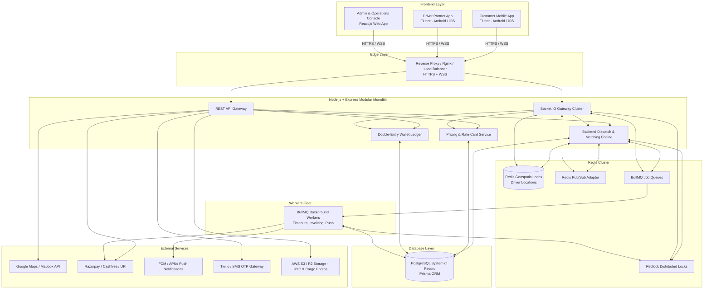
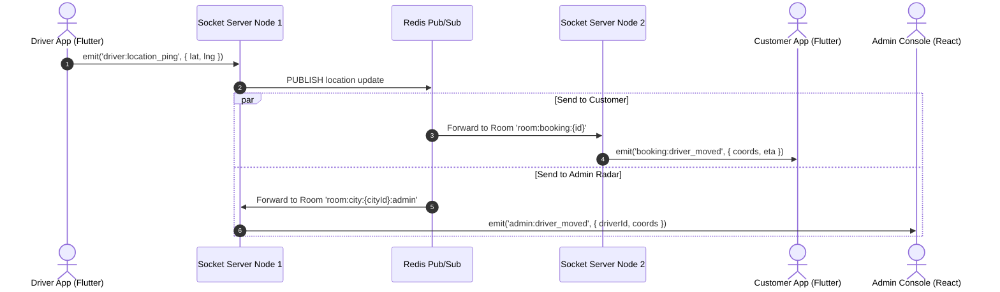
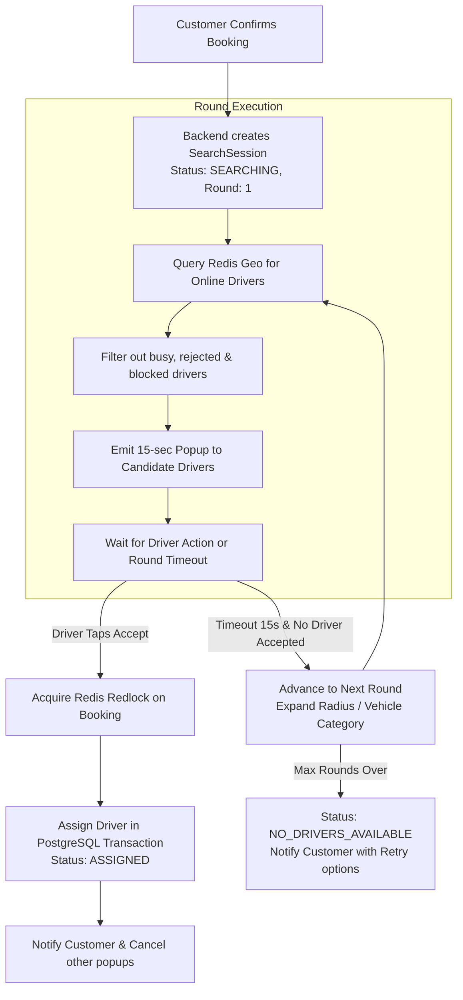
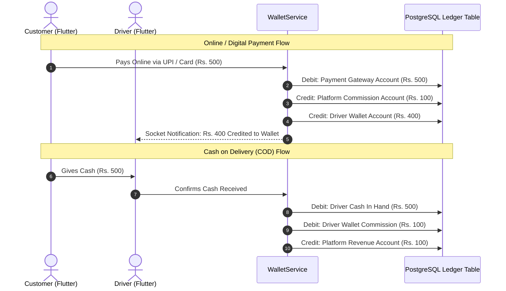

# System Architecture Document (Simple Guide)
**Platform:** On-Demand Logistics & Goods Transportation Platform (Porter-like System)  
**Document Code:** `ARCH-01-SYSTEM-BLUEPRINT`  
**Target Audience:** Developers & Technical Team  

---

## 1. System Overview (Ye System Kya Hai?)

Ye platform ek **Porter jaisa on-demand logistics aur goods delivery system** hai. Iska main kaam customer (`USER`) ko commercial trucks/three-wheelers/bikes ke verified drivers (`DRIVER`) ke saath connect karna aur goods deliver karwana hai.

### Quick Visual Overview
```text
Customer (Flutter App) ──► Booking Request ──► Backend (Node.js) ──► Rate Card / Pricing
                                                      │
                                             Redis Geo Search (Nearby Drivers)
                                                      │
Driver (Flutter App)   ◄── 15s Dispatch Popup ◄───────┘
         │
    Accept Ride
         │
Pickup Goods ──► Enter OTP ──► Start Trip ──► Live GPS Stream ──► Drop Location ──► Settle Payment
```

---

## 2. Fixed Tech Stack (Kaunsi Technology Kaha Use Hogi?)

Humara tech stack strictly fixed hai:

| Platform / Layer | Technology | Kis Ke Liye Use Hoga? |
| :--- | :--- | :--- |
| **Web Admin Platform** | **React.js** | `SUPER_ADMIN`, `CITY_ADMIN`, `EXECUTIVE` ke operations dashboards, live radar map, KYC review, aur rate card settings ke liye. |
| **Mobile Platform** | **Flutter** (Android + iOS) | `USER` (Customer booking app) aur `DRIVER` (Driver partner app with background GPS tracking). |
| **Backend API** | **Node.js + Express.js** | Central source of truth, REST APIs, business logic, auth, pricing aur dispatch engine. |
| **Database** | **PostgreSQL** + **Prisma ORM** | Permanent data (Users, Bookings, Wallets, Ledger, Cities, Rates). |
| **In-Memory / Realtime** | **Redis** | Ephemeral state (Driver live GPS, Redlock distributed locking, BullMQ queues, Pub/Sub). |
| **Realtime Communication**| **Socket.IO** | Live driver tracking, instant dispatch popups, admin radar updates. |
| **Background Jobs** | **BullMQ** | Dispatch round timers, invoice generation, scheduled rides. |

---

## 3. High-Level System Architecture Diagram



---

## 4. Primary Roles (System Ke 5 Main Roles)

System me strictly **5 Primary Roles** hain:

```text
                  SUPER_ADMIN (Global Authority)
                         │
                ┌────────┴────────┐
                │                 │
           CITY_ADMIN         CITY_ADMIN (City Scope)
                │                 │
          ┌─────┼─────┐     ┌─────┼─────┐
        EXEC  EXEC  EXEC   EXEC  EXEC  EXEC (City Desk Staff)

  [USER] (Customer App)      [DRIVER] (Driver App)
  Independent Endpoints      Independent Endpoints
```

1. **`SUPER_ADMIN` (Web):** Poore system ka global owner. Saari cities, global pricing parameters, aur platform ledger dekhta hai.
2. **`CITY_ADMIN` (Web):** Apni specific city ka manager. City rate cards, geofences, aur city executives manage karta hai.
3. **`EXECUTIVE` (Web):** City admin ke under staff. Driver KYC documents verify karta hai, active trips monitor karta hai, aur "Owner Assist" se manual dispatch karta hai.
4. **`USER` (Flutter App):** Goods transport book karta hai, multi-stop add karta hai, live driver track karta hai, aur payment karta hai.
5. **`DRIVER` (Flutter App):** Dispatch popups receive karta hai, background GPS bhejta hai, cargo load/unload karta hai, OTP verify karta hai, aur earnings kamata hai.

---

## 5. Web vs Mobile Platform Division

```text
┌────────────────────────────────────────────────────────────────────────┐
│                        PLATFORM KI DIVISION                            │
├───────────────────────────────────┬────────────────────────────────────┤
│ React.js Web Platform             │ Flutter Mobile Platform            │
│ Target: SUPER_ADMIN, CITY_ADMIN,  │ Target: USER, DRIVER               │
│         EXECUTIVE                 │                                    │
├───────────────────────────────────┼────────────────────────────────────┤
│ • Desktop browser console         │ • Android & iOS Mobile Apps        │
│ • Live City Operations Radar Map  │ • Background GPS Location Engine   │
│ • Driver KYC Verification Desk    │ • Full-screen Audio Dispatch Popup │
│ • Rate Card & Geofence Editor     │ • Turn-by-turn Map navigation      │
│ • Manual "Owner Assist" Dispatch  │ • Native UPI Intent / Payment SDK  │
└───────────────────────────────────┴────────────────────────────────────┘
```

* **Important Rule:** Customer aur Driver **kabhi bhi React web console use nahi karenge**. Wo strictly Flutter mobile apps use karenge.
* React Web aur Flutter Mobile dono **same Node.js Express REST API aur Socket.IO server** se connect hote hain.

---

## 6. Real-Time Architecture (Socket.IO + Redis)

Real-time coordination Socket.IO aur Redis Pub/Sub se hoti hai:



### Socket Rooms
1. `room:user:{userId}`: Customer ke personal notifications aur trip alerts.
2. `room:driver:{driverId}`: Driver ke direct dispatch popup alerts.
3. `room:booking:{bookingId}`: Active trip me Customer, Driver aur Executive ka shared tracking room.
4. `room:city:{cityId}:admin`: City Admins aur Executives ka live radar stream.

### Push Notification Fallback
Agar driver ya customer ka app background me close ho jaye ya socket disconnect ho jaye, to critical alerts (new ride popup) **Firebase (FCM) / Apple (APNs)** high-priority push notification se trigger hote hain jo app ko background me wake-up karte hain.

---

## 7. Dispatch Engine (Rides Driver Ko Kaise Milti Hain?)

Dispatch ka control **100% backend ke paas hota hai**. Mobile app khud decide nahi karta ki kaunsa driver pick hoga.



### Dispatch ke Rules
1. **Rounds & Expansion:** Har round me configurable radius (jaise Round 1: 2km, Round 2: 4km, Round 3: 8km) ke drivers ko search kiya jata hai.
2. **Popup Timer:** Driver ko screen par 15 second ka countdown popup aur audio chime milta hai.
3. **No Double Assignment:** Redis `Redlock` distributed lock use hota hai. Agar do drivers ek hi millisecond me accept dabayein, to pehle driver ko ride milegi, doosre ko graceful message milega.

---

## 8. Pricing & Rate Cards (Ride Ka Fare Kaise Banta Hai?)

Har city ka apna Rate Card hota hai jisme ye components hote hain:

```text
Estimated Fare = 
    Base Fare (includes first X km)
  + (Extra Distance × Per KM Rate Slab)
  + (Estimated Moving Time × Per Minute Moving Rate)
  + (Estimated Waiting Time over Free Limit × Waiting Rate)
  + (Loading / Unloading Helper Charges, if chosen)
  + Tolls / Surcharges
  + GST (Tax)
```

* **Tamper-Proof Quote:** User ko estimate milne ke baad backend ek signed token bhejta hai jo 5 minute ke liye valid hota hai. Client price ko modify nahi kar sakta.

---

## 9. Double-Entry Wallet & Financial Ledger

Paison ka hisab bilkul clear aur tamper-proof double-entry ledger se hota hai:



---

## 10. Multi-City Tenancy (Multiple Cities Kaise Handle Hoti Hain?)

Platform multiple cities me chalta hai bina code ya database duplicate kiye:

```text
┌────────────────────────────────────────────────────────────────────────┐
│                        MULTI-CITY DATA ISOLATION                       │
├────────────────────────────────────────────────────────────────────────┤
│ SUPER_ADMIN  ──► Saari Cities ka data dekh sakta hai.                  │
│ CITY_ADMIN   ──► Sirf APNI city ka data dekh sakta hai.                │
│ EXECUTIVE    ──► Sirf APNI city ke assigned desk tasks dekh sakta hai. │
│ USER         ──► Global customer hai (Indore me bhi book kar sakta     │
│                  hai, Bhopal me bhi). Booking apni city se bind hoti hai│
│ DRIVER       ──► Apni registered city me shift start karta hai.        │
└────────────────────────────────────────────────────────────────────────┘
```

* **Backend Enforcement:** Backend repository me automatically `where: { cityId: req.user.cityId }` inject hota hai. Frontend par kabhi rely nahi kiya jata.

---

## 11. Core Business Step-by-Step Flows

### Flow 1: Ride Booking to Completion
```text
1. USER app kholta hai -> Pickup & Drop locations aur vehicle choose karta hai.
2. Backend pickup coordinate se City detect karta hai aur Rate Card se Fare calculate karta hai.
3. USER confirm karta hai -> Backend SearchSession banata hai.
4. Redis Geo nearby online drivers ko 15 second ka popup bhejta hai.
5. DRIVER "Accept" dabata hai -> Redis lock lagti hai -> Driver ASSIGNED ho jata hai.
6. DRIVER pickup point par pahunchta hai -> Cargo load hota hai -> USER secret OTP deta hai.
7. DRIVER OTP verify karta hai -> Trip IN_TRANSIT ho jati hai.
8. Driver live GPS bhejta rehta hai -> Customer map par live movement dekhta hai.
9. Drop point par cargo unload hota hai -> Final OTP verify hoti hai -> Trip COMPLETED.
10. Payment settle hoti hai (Cash ya Digital) -> Driver wallet update hota hai -> GST Invoice banti hai.
```

### Flow 2: Driver Emergency Breakdown ("Owner Assist")
```text
1. In-transit driver ka breakdown ho gaya -> Driver app me Emergency alert trigger karta hai.
2. React Admin radar par Executive ko instant alert milta hai.
3. Executive live map par doosra nearby free driver select karta hai ("Owner Assist").
4. Backend purane driver ko free karta hai aur naye driver ko ride reassign karta hai.
5. Naye driver ko raste ke waypoints aur cargo photos transfer ho jaati hain.
```

---

## 12. Security & Single-Device Policy

1. **Authentication:** 
   - **React Admin:** Short-lived JWT (15 min) + HttpOnly cookies me Refresh Token.
   - **Flutter Apps:** JWT + Refresh Token stored in Android KeyStore / iOS Keychain via `flutter_secure_storage`.
2. **Single-Device Enforcement:** Driver ya User jab naye phone me login karega, purane phone ka session Redis me blacklist ho jayega aur purana phone turant logout ho jayega. Account sharing strictly block hai.
3. **Role-Based Protection:** Har API route check karti hai `req.user.role` aur `req.user.cityId`.

---

## 13. Failure Handling Summary (System Kaise Safe Rahega?)

| Problem | Solution |
| :--- | :--- |
| **Do drivers ne ek saath Accept dabaya** | Redis `Redlock` distributed lock: Pehle driver ko ride milegi, doosre ko clean error response. |
| **Customer ne cancel kiya jab driver accept kar raha tha** | PostgreSQL atomic transaction: State machine verify karegi, agar cancel pehle ho gaya to driver accept abort ho jayega. |
| **Driver ka app achanak band ho gaya** | Redis 30-sec heartbeat timeout: Driver matching pool se auto-remove ho jayega. |
| **Internet disconnect ho gaya** | App reconnect hone par `GET /api/v1/bookings/active` se fresh state sync karega. |
| **Payment Gateway ka duplicate webhook aaya** | Database me `transactionId` unique constraint: Duplicate webhook discard ho jayega, balance dubara add nahi hoga. |

---

## 14. Architecture Decision Records (ADRs)

* **ADR-001:** Single Modular Monolith backend (Microservices ki transaction complexity se bachne ke liye).
* **ADR-002:** Backend-controlled dispatch engine (Client-side dispatching strictly prohibited).
* **ADR-003:** React for Web Admin Console, Flutter for Customer and Driver Mobile Apps.
* **ADR-004:** PostgreSQL as Single Source of Truth for permanent records + Redis for ephemeral live data.
* **ADR-005:** Row-level `cityId` isolation at repository layer for multi-tenancy.

---
*End of Master System Architecture Document (`Architecture/01-System-Architecture.md`)*
