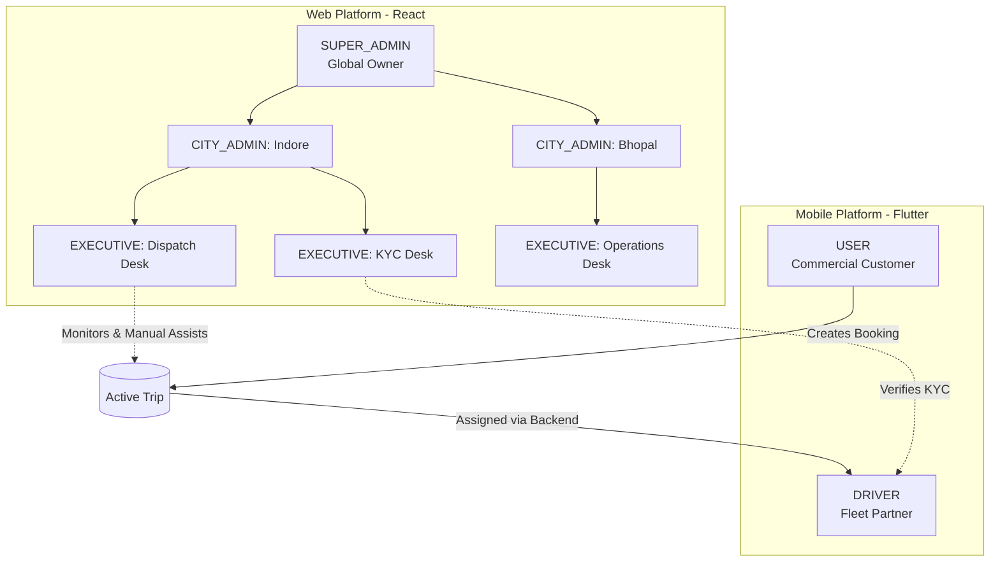
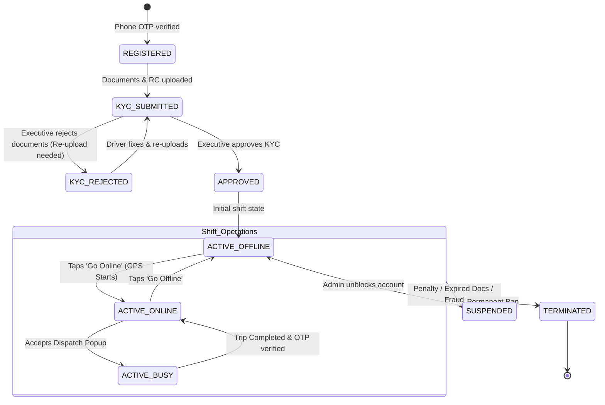
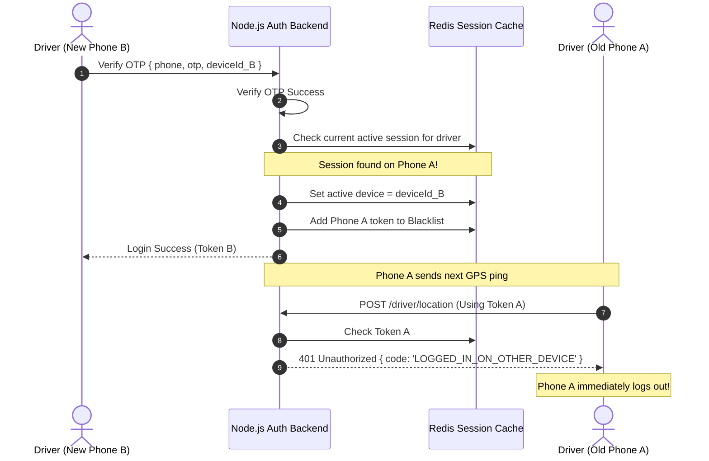
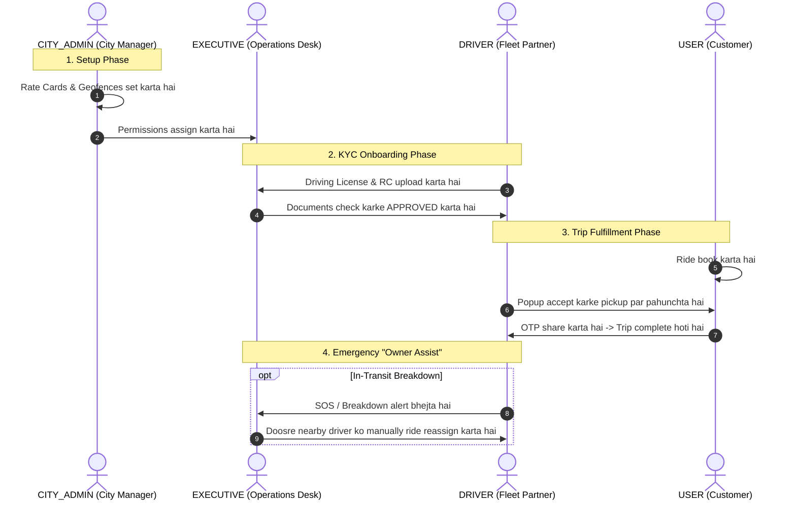

# User & Role Architecture Document (Simple Guide)
**Platform:** On-Demand Logistics & Goods Transportation Platform (Porter-like System)  
**Document Code:** `ARCH-02-USER-ROLE-BLUEPRINT`  
**Target Audience:** Developers & Technical Team  

---

## 1. System Ke 5 Main Roles (Five Primary Roles)

System me strictly **5 Primary Roles** hain. Koi aur naya role (jaise Manager ya Operator) create nahi karna hai:

```text
┌────────────────────────────────────────────────────────────────────────┐
│                        5 PRIMARY SYSTEM ROLES                          │
├────────────────────────────────┬───────────────────────────────────────┤
│ ADMINISTRATIVE ROLES (Web)     │ OPERATIONAL ROLES (Mobile)            │
├────────────────────────────────┼───────────────────────────────────────┤
│ 1. `SUPER_ADMIN`(Global Master)│ 4. `USER` (Customer Booking App)      │
│ 2. `CITY_ADMIN` (City Manager) │ 5. `DRIVER` (Driver Partner App)      │
│ 3. `EXECUTIVE` (City Staff)    │                                       │
└────────────────────────────────┴───────────────────────────────────────┘
```

---

## 2. Role Hierarchy Diagram (Kaun Kiske Under Aata Hai?)



### Important Hierarchy Rules
1. **Administrative Line:** `SUPER_ADMIN` create karta hai `CITY_ADMIN` ko, aur `CITY_ADMIN` manage karta hai apne city ke `EXECUTIVE` ko.
2. **User aur Driver alag hain:** `USER` aur `DRIVER` administrative tree ke bacche (children) nahi hain. Wo independent commercial apps hain.
3. **City Governance:** Driver aur User jab kisi city me ride karte hain, to unpar us city ke `CITY_ADMIN` ke banaye hue Rate Cards aur Geofences apply hote hain.

---

## 3. Har Role Ki Detail Aur Responsibilities

### 3.1 `SUPER_ADMIN` (Global Master Control)
* **Kaha Login Karega:** React.js Web Admin Console.
* **Scope:** Poori country / saari cities ka global access.
* **Kaam Kya Hai:**
  - Nayi city add karna aur band karna.
  - `CITY_ADMIN` ke accounts banana.
  - Master commission percentage aur global payment gateway settings set karna.
  - Sabhi cities ki consolidated income aur audit logs dekhna.

### 3.2 `CITY_ADMIN` (City Head / Manager)
* **Kaha Login Karega:** React.js Web Admin Console.
* **Scope:** Sirf APNI city (`cityId`). Doosri city ka data nahi dekh sakta.
* **Kaam Kya Hai:**
  - Apni city ke Rate Cards set karna (Base fare, per KM charge, waiting charges, GST).
  - City ke Service Areas aur Geofence boundaries draw karna.
  - City ke `EXECUTIVE` staff ko invite karna aur unki permissions set karna.
  - Driver onboarding aur vehicle category availability approve karna.

### 3.3 `EXECUTIVE` (City Operational Staff)
* **Kaha Login Karega:** React.js Web Admin Console.
* **Scope:** Sirf apne parent `CITY_ADMIN` ki city (`cityId`).
* **Kaam Kya Hai:**
  - **KYC Verification:** Driver ke driving license, RC, insurance audit karke approve/reject karna.
  - **Owner Assist (Manual Dispatch):** Agar koi booking atak gayi hai to map par available driver ko manually ride assign karna.
  - **Dispute & Emergency Support:** In-transit truck breakdown hone par turant doosra driver bhejna.

### 3.4 `USER` (Commercial Customer)
* **Kaha Login Karega:** Flutter Mobile App (Android & iOS).
* **Scope:** Apna personal customer account (Global Roaming - Indore me bhi book kare, Bhopal me bhi).
* **Kaam Kya Hai:**
  - Phone OTP se login karna.
  - Pickup aur multiple drop points select karna.
  - Vehicle category choose karna (Bike, Auto, Tata Ace, 8ft Pickup, 14ft Truck).
  - Cargo details aur packet photos upload karna.
  - Driver ko live map par track karna aur delivery par secret OTP share karna.
  - Payment settle karna (Wallet, UPI, Card, ya Cash on Delivery).

### 3.5 `DRIVER` (Fleet Partner / Vehicle Operator)
* **Kaha Login Karega:** Flutter Mobile App (Android & iOS).
* **Scope:** Apna personal driver account aur vehicles.
* **Kaam Kya Hai:**
  - Phone OTP se register karke KYC documents upload karna.
  - Shift `ONLINE` karke background me high-frequency GPS pings bhejna (har 3 second me).
  - 15 second ka audio popup aane par Accept/Reject dabana.
  - Pickup par jakar cargo load karwana aur drop par User se OTP lekar delivery photo upload karna.
  - Apni daily earnings aur wallet balance check karna.

---

## 4. Web vs Mobile Platform Access Matrix

```text
┌────────────────────────────────────────────────────────────────────────┐
│                        PLATFORM ACCESS MATRIX                          │
├───────────────┬────────────────────────────┬───────────────────────────┤
│ Role          │ Ingress Platform           │ Primary Device            │
├───────────────┼────────────────────────────┼───────────────────────────┤
│ `SUPER_ADMIN` │ React.js Web Admin Console │ Desktop / Laptop Browser  │
│ `CITY_ADMIN`  │ React.js Web Admin Console │ Desktop / Laptop Browser  │
│ `EXECUTIVE`   │ React.js Web Admin Console │ Desktop / Laptop Browser  │
│ `USER`        │ Flutter Mobile Application │ Android / iOS Smartphone  │
│ `DRIVER`      │ Flutter Mobile Application │ Android / iOS Smartphone  │
└───────────────┴────────────────────────────┴───────────────────────────┘
```

---

## 5. Driver Partner Ka Complete Lifecycle (State Machine)

Driver ka registration se lekar active trip tak ka state machine:



### Shift ke 3 States
1. `ACTIVE_OFFLINE`: Driver aaram kar raha hai. Location pings band hain. Dispatch me nahi dikhega.
2. `ACTIVE_ONLINE`: Driver duty par hai. Har 3s me Redis me GPS bhej raha hai. Nayi rides mil sakti hain.
3. `ACTIVE_BUSY`: Driver active trip me hai. Naye popups nahi aayenge jab tak trip khatam na ho.

---

## 6. Single-Device Security (Account Sharing Kaise Rokte Hain?)

Driver ya Customer ek time par **sirf ek hi phone me login** reh sakta hai:



---

## 7. Cross-Role Workflows (Roles Milkar Kaise Kaam Karte Hain?)



---

## 8. Summary of ADRs for Roles

* **ADR-008:** Exactly 5 Primary Roles (No role bloat).
* **ADR-009:** Admin on React Web, Customer & Driver on Flutter Mobile.
* **ADR-010:** Backend `cityId` isolation at repository layer.
* **ADR-011:** Single active device policy via Redis deviceId token binding.

---
*End of User & Role Architecture Document (`Architecture/02-User-Role-Architecture.md`)*
