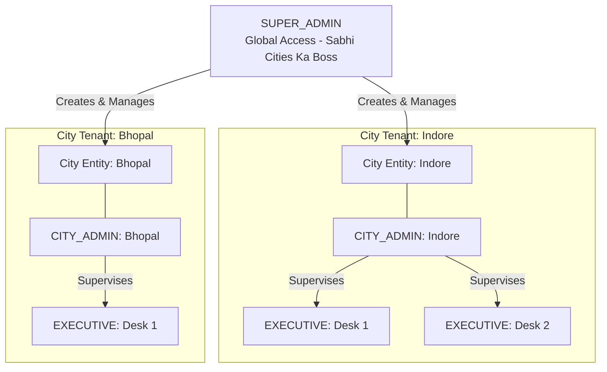
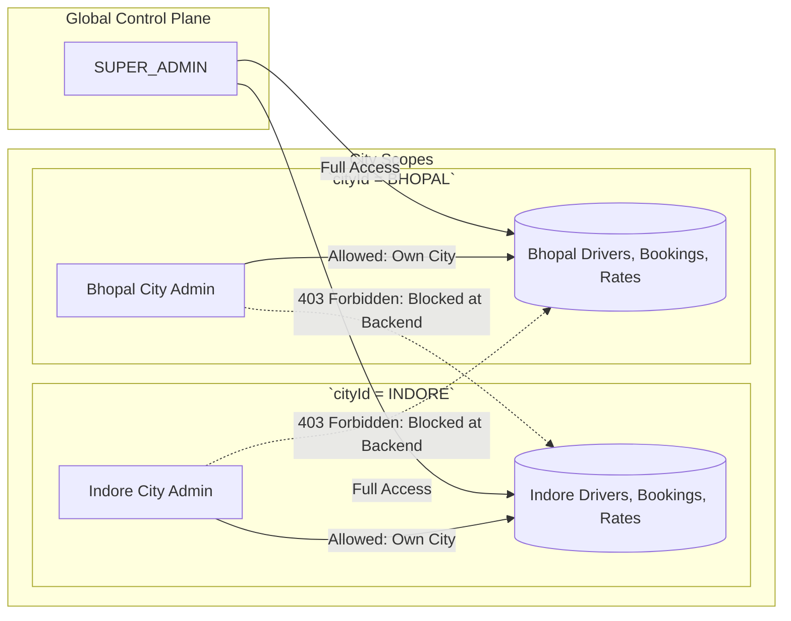
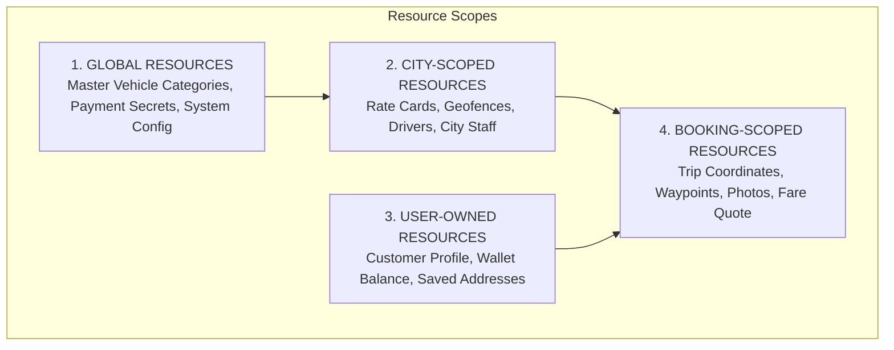
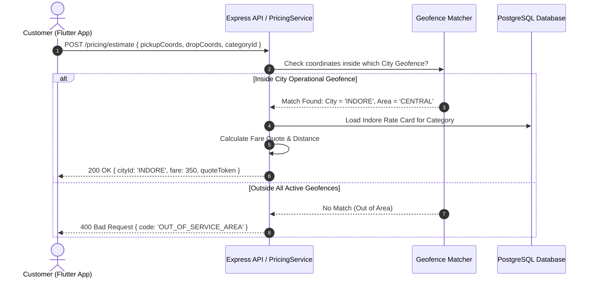
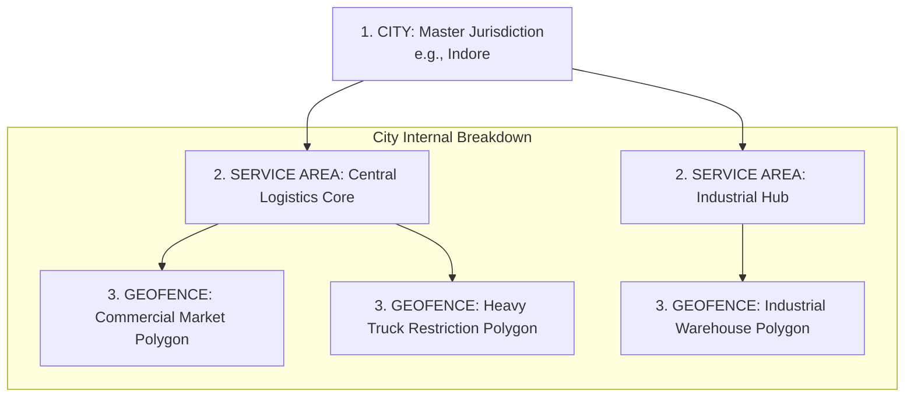
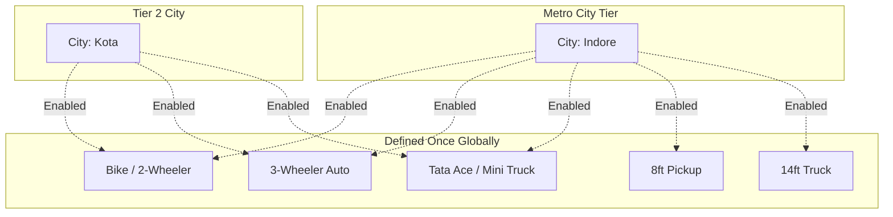
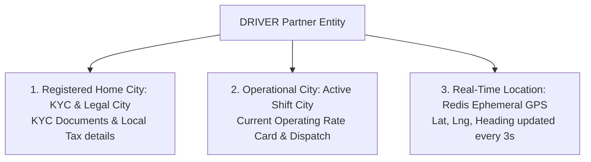
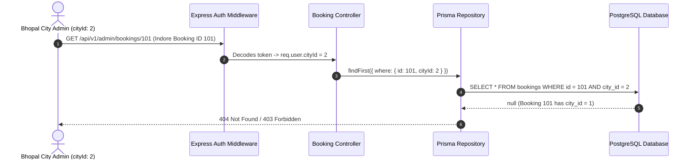
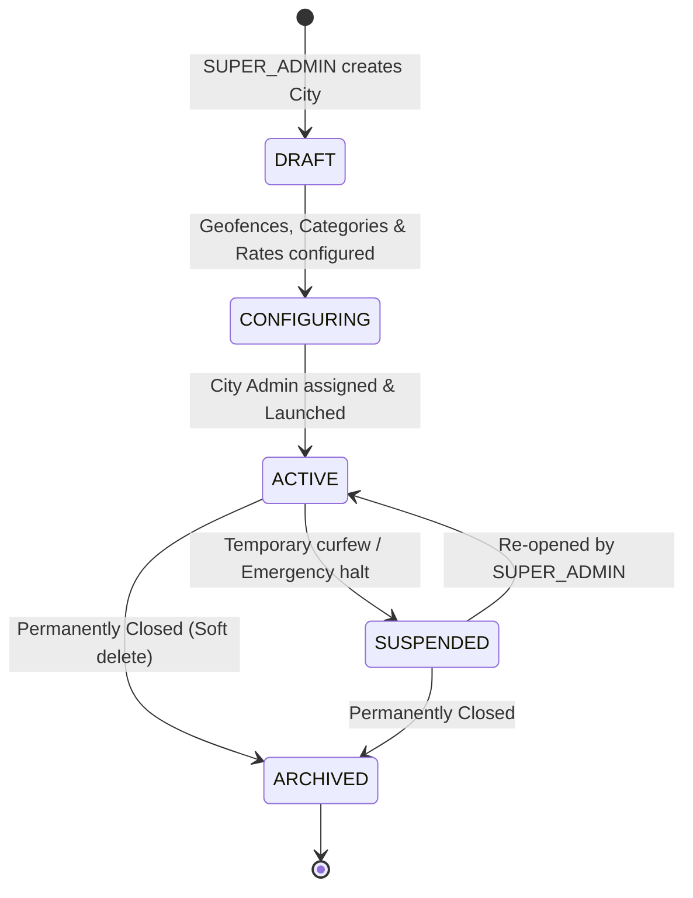
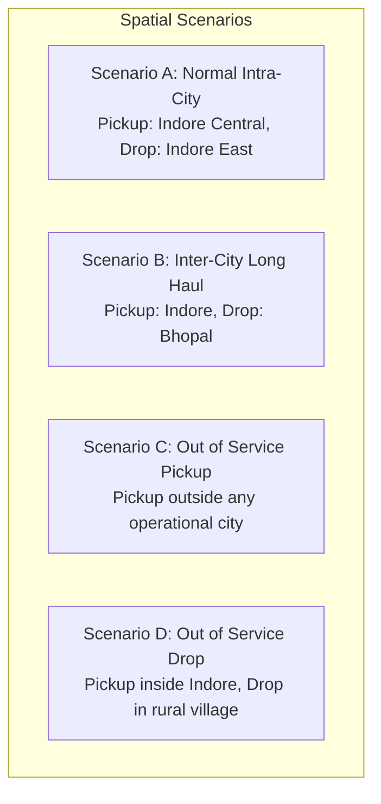

# City & Multi-City Architecture Document (Simple Guide)
**Platform:** On-Demand Logistics & Goods Transportation Platform (Porter-like System)  
**Document Code:** `ARCH-03-CITY-MULTICITY-BLUEPRINT`  
**Target Audience:** Developers & Technical Team  

---

## 1. Purpose (Ye Document Kis Baare Me Hai?)

Ye document batata hai ki humara platform **multiple cities me kaise kaam karega**, har city ke drivers, rate cards, geofences, aur bookings kaise alag-alag manage honge, aur naye city ko bina naya code likhe kaise add kiya jayega.

### Core Golden Rule
> **"Nayi City add karne ke liye koi naya backend server, naya database, ya naya code deploy nahi karna padega."**  
> Nayi city simply Admin Panel se configure karke live ki jayegi.

---

## 2. Multi-City Architecture Overview

```text
┌────────────────────────────────────────────────────────────────────────┐
│                     MULTI-CITY SYSTEM ARCHITECTURE                     │
├────────────────────────────────────────────────────────────────────────┤
│                       1 Single Codebase (Node.js)                      │
│                       1 Single Database (PostgreSQL)                   │
│                       1 Single Redis Cluster                           │
├────────────────────────────────────────────────────────────────────────┤
│  City: INDORE           City: BHOPAL           City: KOTA              │
│  • Own City Admin       • Own City Admin       • Own City Admin        │
│  • Own Rate Cards       • Own Rate Cards       • Own Rate Cards        │
│  • Own Geofences        • Own Geofences        • Own Geofences         │
│  • Own Drivers          • Own Drivers          • Own Drivers           │
└────────────────────────────────────────────────────────────────────────┘
```

---

## 3. City Hierarchy (Hierarchy Kaise Kaam Karegi?)



* **SUPER_ADMIN:** Saari cities create karta hai aur sabka data dekh sakta hai.
* **CITY_ADMIN:** Sirf apni city manage karta hai (jaise Indore City Admin sirf Indore dekhega).
* **EXECUTIVE:** Apne City Admin ke under operational tasks karta hai.

---

## 4. City Entity Kya Kya Store Karti Hai?

Ek **City** entity database me in cheezon ki master setting hoti hai:

```text
┌────────────────────────────────────────────────────────────────────────┐
│                        CITY ENTITY RESPONSIBILITY                      │
├───────────────────────────────┬────────────────────────────────────────┤
│ 1. City Identity              │ Name (e.g., Indore), State, City Code  │
│ 2. Center Coordinates         │ Default Map Latitude & Longitude       │
│ 3. Status                     │ DRAFT, ACTIVE, SUSPENDED, ARCHIVED     │
│ 4. Assigned City Admin        │ bound `cityAdminId`                    │
│ 5. Active Vehicle Categories  │ Enabled vehicle types in this city     │
│ 6. City Rate Cards            │ Base fare, per KM slabs, GST rates     │
│ 7. Service Areas & Geofences  │ Polygon boundaries of operational zones│
│ 8. Dispatch Search Slabs      │ Radius expansion settings (e.g. 2-5-10)│
└───────────────────────────────┴────────────────────────────────────────┘
```

---

## 5. City Admin Relationship (Data Isolation)



* **Golden Rule:** Indore ka City Admin **kabhi bhi Bhopal ka data nahi dekh sakta**.
* Backend har API call me token se `req.user.cityId` check karega aur query me `WHERE cityId = req.user.cityId` lagayega.

---

## 6. Executive City Scope

* Executive ka scope uske parent `CITY_ADMIN` ki city ke barabar hota hai.
* Agar Executive Indore ka hai, to wo sirf Indore ke drivers ka KYC verify karega aur Indore ki bookings ko assist karega.

---

## 7. City-Scoped Resources (Kaunsa Resource Kis Level Par Hoga?)



### Resource Evaluation Table

| Resource | Scope Type | Kyu Aur Kaise? |
| :--- | :--- | :--- |
| `SUPER_ADMIN` | **Global** | Poore system ka global access. |
| `CITY_ADMIN` | **City-Scoped** | Ek specific `cityId` se bound. |
| `EXECUTIVE` | **City-Scoped** | Apne parent city admin ke `cityId` se bound. |
| `USER` | **User-Owned (Global)** | Roaming customer account (Indore me bhi book kare, Bhopal me bhi). |
| `DRIVER` | **Driver-Owned (City-Bound)** | Primary legal registration ek city me hoti hai. |
| `VEHICLE CATEGORY` | **Global Master + City Enablement** | Master definition global hai; har city me on/off hoti hai. |
| `RATE CARD / PRICING`| **City-Scoped** | Har city ka alag rate card hota hai. |
| `SERVICE AREA` | **City-Scoped** | City ke andar ke sub-clusters (e.g. Central, Industrial). |
| `GEO-FENCE` | **City-Scoped** | Spatial polygon boundary. |
| `DRIVER LIVE GPS` | **Ephemeral (City-Sharded)** | Redis me city ke hisab se sharded (`drivers:city:{cityId}`). |
| `BOOKING` | **Booking-Scoped (City-Bound)** | Booking pickup location ke hisab se `cityId` se lock hoti hai. |
| `CUSTOMER WALLET` | **User-Owned** | Global wallet balance (har city me use ho sakta hai). |
| `DRIVER WALLET` | **Driver-Owned** | Driver ki earnings aur platform commission deduction ka wallet. |

---

## 8. Booking Ki City Kaise Decide Hoti Hai? (Resolution Flow)

Jab customer pickup choose karta hai, to system backend par spatial match karta hai:



### Important Rule
* **Pickup location city decide karti hai:** Intracity trips me pickup point se `cityId` lock hoti hai aur usi city ka Rate Card aur Driver Pool use hota hai.

---

## 9. City vs. Service Area vs. Geofence (Teeno Me Fark)

In teeno ko mix nahi karna hai:



1. **City:** Poori administrative municipality (e.g., Indore). Iska apna City Admin aur Tax setup hota hai.
2. **Service Area:** City ke andar ka operational zone (e.g., Central, West Industrial Zone, Airport Area).
3. **Geofence:** Map par draw kiya gaya exact Polygon boundary jisme rules lagte hain (Allowed, Restricted, Toll/Surge, No-Service).

---

## 10. City-Specific Vehicle Category Availability

Hum har city ke liye naye vehicle types database me duplicate nahi karenge:



* **Benefit:** "Tata Ace" ka name, icon, aur dimensions global master catalog me ek baar banti hain. City Admin sirf toggle on/off karta hai aur apna city rate card attach karta hai.

---

## 11. City Rate Card & Pricing

Har city me pricing alag ho sakti hai:

```text
Indore Tata Ace Rate Card:
- Base Fare: Rs. 250 (includes first 2 km)
- Per KM Rate: Rs. 22 / km
- Moving Time Rate: Rs. 1.5 / min
- Free Waiting Time: 15 mins (Loading/Unloading)
- Extra Waiting Rate: Rs. 3 / min
- GST: 5% (SAC Code 9965)
```

---

## 12. City Search Radius Options

Har city ki traffic aur road structure alag hoti hai, isliye search radius slabs **city settings me configurable** hote hain:

```text
Dense Metro City (e.g. Mumbai / Indore):
  Round 1: 1.5 km  ──► Round 2: 3.0 km  ──► Round 3: 5.0 km

Expansive / Industrial City:
  Round 1: 3.0 km  ──► Round 2: 7.0 km  ──► Round 3: 15.0 km
```

---

## 13. Driver City vs Current GPS Location

Driver ke context me in 3 cheezon ko alag rakhna hai:



---

## 14. Backend City Data Isolation (Security)

Frontend route hiding par bilkul rely nahi karna hai. Backend database query me check lagayega:



---

## 15. City Lifecycle (Nayi City Kaise Banti Hai Aur Band Hoti Hai?)



* **Important Rule:** City ko database se hard delete `DROP` **kabhi nahi karte**. Agar city band hoti hai to status `ARCHIVED` ho jata hai taaki purani bookings aur GST tax records hamesha safe rahein.

---

## 16. City Onboarding Step-by-Step

Nayi city launch karne ka step-by-step process:

```text
Step 1: SUPER_ADMIN admin panel me "Create City" dabata hai (Name, Coordinates).
Step 2: Map par initial Service Area aur Geofence draw karta hai.
Step 3: City me kaun-kaun se Vehicle Categories chalenge unhe ON karta hai.
Step 4: Har vehicle category ka Rate Card aur GST details feed karta hai.
Step 5: Dispatch Search Radius (e.g. 2km -> 4km -> 8km) configure karta hai.
Step 6: CITY_ADMIN ka account banakar invite bhejta hai.
Step 7: CITY_ADMIN local drivers ka KYC onboard aur approve karta hai.
Step 8: City status ko ACTIVE kar diya jata hai -> Mobile apps me booking chalu!
```

---

## 17. Cross-City Booking Scenarios (Inter-City & Out-of-Area)



### Scenario Handling

| Scenario | Kya Hoga? | Status |
| :--- | :--- | :--- |
| **Scenario A (Intra-City)** | Standard flow. Pickup city ka rate card aur local drivers use honge. | **Supported (Core)** |
| **Scenario B (Inter-City)** | Long-distance trip. Pickup city ka rate card + toll charges apply honge. | **Architectural Ready** *(Pricing rules TO BE CONFIRMED)* |
| **Scenario C (Out of Area Pickup)**| App me turant error aayega: "Service not available at this pickup location". | **Supported (Blocked)** |
| **Scenario D (Out of Area Drop)**  | Ride allow hogi lekin return deadhead distance surcharge lag sakta hai. | **Architectural Ready** *(Surcharge rule TO BE CONFIRMED)* |

---

## 18. City & Dispatch Sharding in Redis

High performance ke liye Redis me driver keys city ke hisab se sharded hoti hain:

```text
Redis Key: drivers:city:INDORE  ──► [ Driver101 (Lat, Lng), Driver102 (Lat, Lng) ]
Redis Key: drivers:city:BHOPAL  ──► [ Driver201 (Lat, Lng), Driver202 (Lat, Lng) ]
```

* Jab Indore me booking aati hai to search query sirf `drivers:city:INDORE` me dekhti hai. Poore desh ke drivers scan nahi hote, jisse lookup time **2 milliseconds se bhi kam** rehta hai.

---

## 19. Open Questions / Client Confirmation Required

Ye business rules client ke saath confirm karne hain:

```text
[ ] 1. Inter-City Fare Rule: Kya cross-city trip par origin city ka rate lagega ya special long-haul rate?
[ ] 2. Out-of-Area Drop Surcharge: Kya service area ke bahar drop karne par driver ko return-distance charge milega?
[ ] 3. Driver Inter-City Roaming: Kya Indore ka driver Bhopal jakar bina naye KYC ke shift start kar sakta hai?
```

---
*End of City & Multi-City Architecture Document (`Architecture/03-City-Architecture.md`)*
