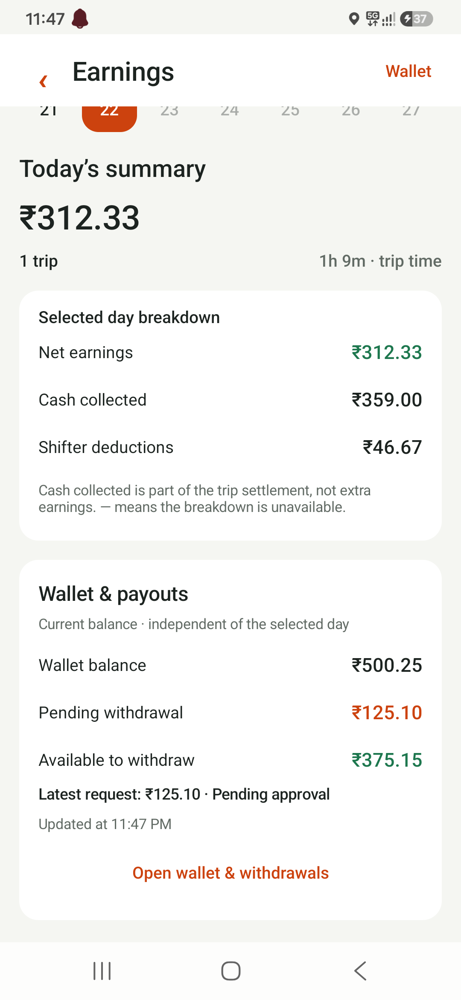

# Driver earnings and device review — 22 September 2026

## Implemented

- Selected-day net earnings, cash collected, and Shifter deductions shown separately.
- Missing cash/deduction fields remain unavailable instead of becoming zero.
- Current wallet balance, pending withdrawal reservations, available withdrawal amount, and latest request status.
- Explicit current-wallet scope, last updated time, loading, retry, and stale-data states.
- New English and Hindi labels; existing trip receipts and wallet actions preserved.
- Read-only driver wallet API extension; customer wallet payload remains unchanged. No database migration.

## Checks

- Android debug and instrumentation APKs build successfully.
- 18 Android JVM tests passed, including cash/online/missing settlement cases.
- 6 backend tests passed, including pending reservation accounting, negative available-balance clamping, date-filter independence, and customer compatibility.
- Samsung SM-E156B: earnings UI, sample breakdown, empty state, stale balance, and receipt smoke test passed. Screenshot uses test fixtures, not the driver's actual balance.
- Practice ride and isolated socket reconnect checks: final results being collected.

## Deployment and limits

The review APK was installed as an update on the connected phone with the existing app signing key. App data was preserved. It is a **debug review build pointing at the development API**, not a production release.

The backend response extension is local and has not been deployed. Until deployment, the app shows withdrawal details as unavailable on older responses. New fields: `pending_withdrawal_amount`, `available_to_withdraw`, `latest_withdrawal`.

The native ride smoke tests use the existing local practice flow. The socket test uses a local Socket.IO fixture through ADB reverse; it does not create live dispatch orders. Real customer dispatch, background/locked-screen FCM delivery, and on-road GPS still require a controlled live order test.

Mobile source remains local under the repository's existing `.gitignore` policy.

## Screenshot

